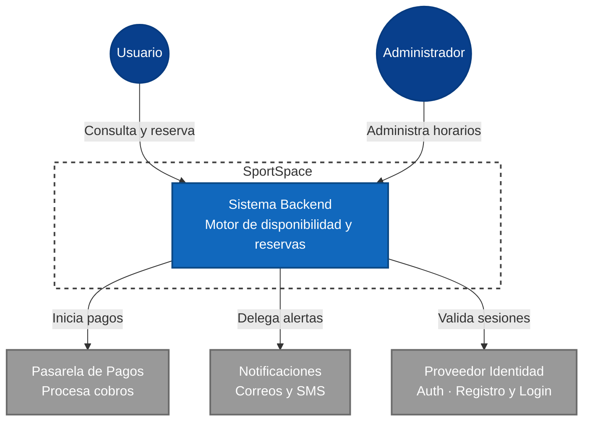

## Infraestructura en la Nube

# SportSpace
### Sistema de Reservas y Disponibilidad de Canchas Deportivas y Espacios Recreativos

| | |
|---|---|
| **Integrantes** | Douglas Perez · Carlos Daniel Martinez · Ana Isabel Perez |

---

## 0. Resumen de Cambios (Iteración respecto a Entrega 1)

A partir de la retroalimentación obtenida y nuestras discusiones técnicas en esta segunda iteración, realizamos los siguientes ajustes respecto a nuestra propuesta inicial en la Entrega 1:
* **Decisión de Cómputo:** Inicialmente no teníamos claro si nos iríamos por contenedores o funciones Serverless. Tras analizar el comportamiento de las reservas (tráfico intermitente y en ráfagas), decidimos descartar los contenedores (que implican pagos por capacidad continua) y elegimos **AWS Lambda**. Esto nos permite mantener los costos bajos durante la fase MVP.
* **Definición del Modelo de Datos:** Pasamos de un concepto ambiguo a un modelo concreto basado en **AWS DynamoDB**. Decidimos abandonar la idea de usar bases de datos relacionales tradicionales porque las consultas que nos interesan (disponibilidad por fecha/cancha y reservas por usuario) pueden resolverse muy bien utilizando un esquema de tabla única y Global Secondary Indexes (GSIs). 
* **Manejo de Archivos:** Nos dimos cuenta de que requeríamos almacenar los comprobantes inmutables generados para los usuarios, por lo que decidimos acoplar un almacenamiento de objetos con **Amazon S3** específicamente para dichos *vouchers*.

## 1. Resumen Ejecutivo

Reservar una cancha de fútbol, básquetbol o tenis en Guatemala implica hoy llamadas telefónicas, mensajes de WhatsApp a grupos informales o presentarse físicamente al lugar para ver si hay espacio disponible. El resultado es predecible: doble reserva del mismo espacio, cancelaciones de último minuto sin aviso, y administradores que pierden horas coordinando manualmente lo que un sistema podría hacer en segundos.

**SportSpace** es un sistema backend que centraliza la disponibilidad en tiempo real de canchas deportivas y espacios recreativos (canchas de fútbol, básquetbol, tenis, pádel, salones multiusos), permite a los usuarios hacer reservas con confirmación inmediata, gestiona cancelaciones con políticas configurables y notifica automáticamente a todas las partes involucradas.

El sistema sirve a dos tipos de organizaciones: complejos deportivos privados (canchas de alquiler) y clubes o asociaciones que administran espacios para sus miembros. En ambos casos, SportSpace elimina la coordinación manual, reduce las cancelaciones sin aviso y genera visibilidad sobre la utilización real de cada espacio.

---

## 2. Actores

### 2.1 Actores Primarios

- **Usuario / Deportista:** Persona que busca disponibilidad, hace una reserva, la modifica o la cancela. Interactúa principalmente a través de una app móvil o web. Espera confirmación inmediata y recordatorios antes de su reserva.
- **Administrador del Complejo:** Persona que gestiona uno o varios espacios deportivos. Configura horarios, precios, bloqueos de mantenimiento y consulta reportes de utilización. Es el cliente principal del sistema.

### 2.2 Actores de Soporte

- **Pasarela de Pagos:** Sistema externo que procesa el pago al momento de confirmar la reserva. El sistema de reservas no almacena datos de tarjeta.
- **Proveedor de Notificaciones:** Servicio externo que entrega correos electrónicos y SMS de confirmación, recordatorio y cancelación.
- **Proveedor de Identidad:** Gestiona autenticación y sesiones de usuarios y administradores, sin que SportSpace maneje contraseñas directamente.

---

## 3. Casos de Uso Priorizados

Se listan 7 user stories ordenadas por prioridad. **P0** = crítico para el sistema; **P1** = importante pero no bloquea el MVP; **P2** = valioso pero diferible.

| ID | Prior. | User Story | Criterio de Éxito | Componente |
|----|--------|------------|-------------------|------------|
| UC-01 | **P0** | Como deportista, quiero ver la disponibilidad de una cancha por fecha y hora para decidir cuándo reservar. | La consulta retorna un resultado libres/ocupados en < 1 s para un día dado. | Cómputo / BD |
| UC-02 | **P0** | Como deportista, quiero reservar una cancha disponible y recibir confirmación inmediata con número de reserva. | La reserva se crea atómicamente; no pueden existir dos reservas para la misma cancha. | Cómputo / BD / Async |
| UC-03 | **P0** | Como deportista, quiero cancelar una reserva y recibir notificación de la política de reembolso aplicable. | La cancelación libera el espacio dentro de 2 s; se dispara notificación al usuario. | Cómputo / Async |
| UC-04 | **P0** | Como administrador, quiero configurar los horarios disponibles y precios por hora de cada cancha. | Los cambios de disponibilidad se reflejan en la vista del deportista en < 30 s. | Cómputo / BD |
| UC-05 | **P1** | Como deportista, quiero recibir un recordatorio 1 día antes de mi reserva para no olvidarla. | El recordatorio llega por email o SMS. | Async / Notificaciones |
| UC-06 | **P1** | Como administrador, quiero bloquear un espacio por mantenimiento sin afectar otras canchas del complejo. | El bloqueo impide nuevas reservas en ese espacio; las existentes se notifican automáticamente. | Cómputo / BD / Async |
| UC-07 | **P2** | Como administrador, quiero ver un reporte de utilización mensual por cancha para tomar decisiones de precio. | El reporte muestra el porcentaje de ocupación en base a día y cantidad de horas. | BD / Almacenamiento |

---

## 4. Funcionalidades Específicas del Proyecto

### 4.1 Motor de Disponibilidad en Tiempo Real

- Consulta de espacios libres considerando: horarios configurados, reservas existentes, bloqueos de mantenimiento y tiempos de limpieza entre reservas.
- Soporte para múltiples tipos de espacio dentro de un mismo complejo.

### 4.2 Reserva con Bloqueo Optimista

- Al iniciar el proceso de reserva, el espacio se marca como "en proceso" por **15 minutos** para evitar que otro usuario lo tome simultáneamente.
- Si el pago no se completa en ese tiempo, el espacio se libera automáticamente.
- Generación de código único de reserva para identificación presencial.

### 4.3 Gestión de Cancelaciones con Políticas

- Política de cancelación configurable por complejo.
- Cuando se cancela un espacio, se dispara evento que puede notificar a usuarios en lista de espera.

### 4.4 Panel de Administración

- Vista de agenda diaria, semanal y mensual por complejo con visualización de espacios: libre (verde), reservado (azul), bloqueado (gris), en proceso (amarillo).
- Configuración de bloqueos por mantenimiento con opción de bloqueo recurrente.
- Dashboard con métricas de uso.

### 4.5 Notificaciones Multi-evento

- Confirmación de reserva.
- Recordatorio 1 día antes de la reserva.
- Aviso de cancelación.
- Notificación cuando un espacio bloqueado vuelve a estar disponible.

---

## 5. Mockups

Los siguientes mockups representan las pantallas principales que cubren los casos de uso priorizados. El objetivo es comunicar flujo e información, no diseño visual final.

### Mockup 1 — Búsqueda de Disponibilidad (UC-01)

```
┌─────────────────────────────────────────────────────┐
│  SportSpace                          [Mi cuenta] [☰] │
├─────────────────────────────────────────────────────┤
│                                                     │
│  Buscar cancha                                      │
│  ┌───────────────┐ ┌──────────┐ ┌───────────────┐  │
│  │ Deporte: Tenis│ │15/05/26  │ │ Zona: Norte   │  │
│  └───────────────┘ └──────────┘ └───────────────┘  │
│                           [  BUSCAR DISPONIBILIDAD ] │
│                                                     │
│  Resultados — Complejo Las Américas, Cancha 3       │
│  ┌──────┬──────┬──────┬──────┬──────┬──────┐       │
│  │ 7:00 │ 8:00 │ 9:00 │10:00 │11:00 │12:00 │       │
│  │ [///]│ [OK] │ [OK] │[////]│ [OK] │[////]│       │
│  └──────┴──────┴──────┴──────┴──────┴──────┘       │
│  [///] = Ocupado    [OK] = Disponible (Q75/hora)    │
└─────────────────────────────────────────────────────┘
```

El usuario selecciona deporte, fecha y zona. El sistema retorna los espacios disponibles del complejo más cercano que tenga el deporte solicitado. Los espacios ocupados se muestran sombreados; al hacer clic en uno disponible, avanza al flujo de reserva.

---

### Mockup 2 — Confirmación de Reserva (UC-02)

```
┌─────────────────────────────────────────────────────┐
│  SportSpace > Reservar                              │
├─────────────────────────────────────────────────────┤
│                                                     │
│  Resumen de tu reserva                              │
│  Complejo: Las Américas, Zona Norte                 │
│  Espacio:  Cancha de Tenis No. 3                    │
│  Fecha:    jueves 15 mayo 2026                      │
│  Horario:  09:00 – 10:00 (1 hora)                   │
│  ─────────────────────────────────────────────────  │
│  Costo: Q75.00    Política: cancelación libre 4h+   │
│  ─────────────────────────────────────────────────  │
│  Método de pago                                     │
│  ● Tarjeta terminada en 4321  ○ Agregar nueva       │
│                                                     │
│             [  CONFIRMAR Y PAGAR Q75.00  ]          │
│                                                     │
│  ** Tienes 15 min para confirmar antes de que el    │
│     espacio se libere. Tiempo restante: 14:38       │
└─────────────────────────────────────────────────────┘
```

El espacio queda en estado "en proceso" durante 15 minutos. La cuenta regresiva es visible. Al confirmar, se invoca el módulo de pagos y, si es exitoso, se genera el número de reserva y se dispara la notificación de confirmación.

---

### Mockup 3 — Voucher de Reserva Confirmada (UC-02)

```
┌─────────────────────────────────────────────────────┐
│  SportSpace                                         │
│                                                     │
│         ✓  Reserva confirmada                       │
│                                                     │
│  Código:   SPT-2026-004821                          │
│  Complejo: Las Américas, Zona Norte                 │
│  Cancha:   Tenis No. 3                              │
│  Cuando:   jueves 15 mayo 2026 · 09:00–10:00        │
│  Pagado:   Q75.00 (Visa *4321)                      │
│                                                     │
│  [ Ver en Calendario ]  [ Cancelar reserva ]        │
│                                                     │
│  Se envió confirmación a: juan@email.com            │
└─────────────────────────────────────────────────────┘
```

El código se usa para identificación presencial. El usuario también recibe el voucher por email. El botón "Cancelar reserva" aplica la política configurada por el administrador.

---

### Mockup 4 — Cancelación de Reserva (UC-03)

```
┌─────────────────────────────────────────────────────┐
│  Cancelar reserva SPT-2026-004821                   │
├─────────────────────────────────────────────────────┤
│                                                     │
│  Tenis No. 3 · 15 mayo 2026 · 09:00–10:00           │
│                                                     │
│  Política de cancelación:                           │
│  ● Antes de hoy 21:00 → Reembolso 100% (Q75.00)     │
│  ○ 14 may 21:00 – 15 may 08:00 → Reembolso 50%      │
│  ○ Después de 15 may 08:00 → Sin reembolso           │
│                                                     │
│  Si cancelas ahora recibirás Q75.00 de vuelta.      │
│                                                     │
│    [ CONFIRMAR CANCELACIÓN ]  [ Volver ]            │
└─────────────────────────────────────────────────────┘
```

El sistema muestra la política vigente calculada desde el momento actual. El reembolso aplica al mismo método de pago original.

---

### Mockup 5 — Agenda del Administrador (UC-04, UC-06)

```
┌─────────────────────────────────────────────────────┐
│  Admin — Complejo Las Américas     [+ Bloqueo] [⚙️] │
├────────┬───────────────┬───────────────┬────────────┤
│ Hora   │  Tenis 1      │  Tenis 2      │  Padel 1   │
├────────┼───────────────┼───────────────┼────────────┤
│ 07:00  │ [Libre]       │ [Libre]       │ [BLOQUEO]  │
│ 08:00  │ [■ Gonzalez]  │ [Libre]       │ [BLOQUEO]  │
│ 09:00  │ [■ Perez]     │ [■ Martinez]  │ [Libre]    │
│ 10:00  │ [Libre]       │ [■ Lopez]     │ [■ Torres] │
│ 11:00  │ [~ En proceso]│ [Libre]       │ [Libre]    │
├────────┴───────────────┴───────────────┴────────────┤
│ [Libre]=verde  [■]=azul(reservado)  [~]=amarillo    │
│ [BLOQUEO]=gris oscuro                               │
└─────────────────────────────────────────────────────┘
```

El administrador puede hacer clic en cualquier espacio libre para crear un bloqueo o una reserva manual. Los bloqueos muestran el motivo al pasar el cursor sobre ellos.

---

### Mockup 6 — Configuración de Cancha (UC-04)

```
┌─────────────────────────────────────────────────────┐
│  Configurar espacio: Tenis No. 3           [Guardar] │
├─────────────────────────────────────────────────────┤
│  Nombre:      [Tenis No. 3          ]               │
│  Tipo:        [Tenis              v ]               │
│  Espacio:     [● 60 min] [○ 30 min] [○ 90 min]      │
│  Limpieza:    [15 min entre reservas          ]     │
│  Precio/hora: [Q75.00            ]                  │
│                                                     │
│  Política de cancelación                            │
│  Libre hasta: [4] horas antes del slot              │
│  Penalidad:   [50]% entre [4] y [1] horas           │
│  Sin reembolso: menos de [1] hora antes             │
└─────────────────────────────────────────────────────┘
```

Cada espacio tiene su propia configuración y política de cancelación. El tiempo de limpieza entre reservas se descuenta automáticamente de la disponibilidad.

---

### Mockup 7 — Mis Reservas (UC-03, UC-05)

```
┌─────────────────────────────────────────────────────┐
│  Mis Reservas                  [Próximas][Historial] │
├─────────────────────────────────────────────────────┤
│                                                     │
│  ┌───────────────────────────────────────────────┐  │
│  │ SPT-2026-004821  ●CONFIRMADA                  │  │
│  │ Tenis No.3 · Las Américas                     │  │
│  │ jue 15 mayo 2026 · 09:00–10:00  · Q75.00      │  │
│  │ [Ver detalle] [Cancelar] [Agregar al cal.]    │  │
│  └───────────────────────────────────────────────┘  │
│                                                     │
│  ┌───────────────────────────────────────────────┐  │
│  │ SPT-2026-004790  ●CONFIRMADA                  │  │
│  │ Futbol 5 · Complejo Norte                     │  │
│  │ sab 17 mayo 2026 · 18:00–19:00  · Q200.00     │  │
│  │ [Ver detalle] [Cancelar] [Agregar al cal.]    │  │
│  └───────────────────────────────────────────────┘  │
│                                                     │
│           [  + NUEVA RESERVA  ]                     │
└─────────────────────────────────────────────────────┘
```

Vista consolidada de todas las reservas activas del usuario. Cada tarjeta muestra el estado visual y las acciones disponibles según política.

---

## 6. Mapeo a Conceptos del Curso

| Componente del Curso | Cómo lo ejercita SportSpace | Caso de Uso relacionado |
|---|---|---|
| **Cómputo (API)** | El endpoint `POST /reservas` recibe la solicitud, aplica el bloqueo optimista de 15 min y desencadena el flujo de pago. El endpoint `GET /disponibilidad/:espacioId/:fecha` retorna espacios obtenidos en tiempo real. | UC-01, UC-02 |
| **Base de datos** | Entidades: Espacio, Reserva, Bloqueo, Complejo, Usuario. Queries críticos: espacios disponibles por fecha (excluir reservas y bloqueos traslapados), reservas activas por usuario, utilización por franja horaria. | UC-01, UC-04, UC-07 |
| **Almacenamiento de archivos** | Vouchers PDF de cada reserva confirmada almacenados en S3. Reportes de utilización mensual generados bajo demanda y guardados como archivos para descarga. | UC-02, UC-07 |
| **Red** | Capa pública: API Gateway + load balancer que recibe requests del FE/móvil. Capa privada: base de datos de reservas y workers de notificaciones, sin exposición directa a internet. | Todos |
| **Procesamiento asíncrono** | (1) Expiración de bloqueos optimistas: evento disparado a los 15 min si el pago no se completa. (2) Envío de notificaciones de confirmación/recordatorio. | UC-02, UC-03, UC-05 |
| **Seguridad** | Solo el titular de una reserva puede cancelarla (validación por JWT + userId). El administrador solo puede gestionar espacios de su complejo. Política de acceso por rol: USER vs ADMIN. | UC-03, UC-04, UC-06 |
| **Observabilidad** | Métrica clave: espacios expirados sin completar pago. Alarma: tasa de error en endpoint de reserva > 1% en 15 min. Log estructurado con reservaId en cada operación. | UC-02 |

---

## 7. Scope del Sistema

### 7.1 IN — Lo que SÍ hace SportSpace

- Consulta de disponibilidad en tiempo real de canchas y espacios registrados.
- Reserva de espacios con bloqueo optimista de 15 minutos durante el proceso de pago.
- Integración con módulo de pagos externo para procesar el cobro.
- Cancelación de reservas con aplicación automática de política de reembolso configurable.
- Notificaciones por email de confirmación, recordatorio y cancelación.
- Panel de administración para configurar espacios, horarios, precios y bloqueos.
- Bloqueos de mantenimiento con notificación a reservas afectadas.
- Reporte de utilización por espacio.

### 7.2 OUT — Lo que SportSpace NO hace (en este diseño)

- El sistema soporta múltiples complejos pero no un modelo de negocio tipo plataforma.
- Lista de espera automatizada.
- Integración con calendarios externos.
- Sistema de puntos, membresías o fidelización.
- Procesamiento de imágenes de las canchas (fotos): se asume que las imágenes son URLs externas.

---

## 8. Diagrama de Contexto

El siguiente diagrama muestra el límite del sistema SportSpace y sus integraciones externas:



---

## 9. Decisión de Cómputo

Elegimos **AWS Lambda** como plataforma de cómputo principal para los endpoints de la API de nuestro sistema.

* **Enfoque Elegido:** Serverless (AWS Lambda usando Python 3.12).
* **Trade-off 1 (Costo por Invocación vs. Costo Constante - Lambda vs ECS Fargate):** Decidimos optar por el esquema Serverless debido a que el tráfico de SportSpace tiende a ser intermitente y presenta ráfagas (reservas que caen de golpe a cierta hora). En lugar de usar ECS Fargate, que requeriría pagar por contenedores encendidos 24/7 escuchando tráfico, aceptamos perder el entorno siempre activo para lograr que nuestro MVP se mantenga dentro del "Free Tier", pagando únicamente cuando hay invocaciones.
* **Trade-off 2 (Simplicidad de Operación vs. Control del Entorno):** Aceptamos perder el control sobre el sistema operativo subyacente y las configuraciones de red internas que tendríamos con instancias EC2 o contenedores, ganando a cambio el no tener que preocuparnos por parches de seguridad, mantenimiento de servidores o configuración de métricas de Auto Scaling.
* **Desventaja Reconocida:** *Cold Starts* (Arranques en frío). Somos conscientes de que, al estar en reposo, la primera invocación a nuestra API de reservas tomará un tiempo extra (típicamente 200-500ms) mientras el contenedor de la Lambda se aprovisiona y levanta el intérprete de Python, lo cual podría degradar levemente la percepción inicial de rendimiento para el primer usuario tras inactividad. 

---

## 10. Modelo de Datos y Almacenamiento

### 10.1 Estructura en Base de Datos (DynamoDB)
Decidimos implementar **AWS DynamoDB** (base de datos NoSQL gestionada) utilizando un esquema de tabla única (Single Table Design) alrededor de la tabla principal `reservas`.

**Patrones de Acceso e Índices que definimos:**
1. **UC-01 (Consultar disponibilidad):** Creamos un GSI (Global Secondary Index) llamado `espacio-fecha-index`. Esto nos permite consultar rápidamente por el ID de la cancha como llave de partición y buscar rangos de tiempo para verificar la disponibilidad real.
2. **UC-03 (Consultar mis reservas):** Creamos un segundo GSI llamado `usuario-fecha-index` para poder recuperar todo el historial y reservas futuras de un deportista en particular.
3. **Reserva atómica y expiración:** Implementamos el atributo `expires_at` que hace uso de la funcionalidad TTL (Time-to-Live) nativa de DynamoDB. Esto nos permite eliminar automáticamente las reservas temporales (lock optimista) si el usuario no concreta el pago en 15 minutos.

### 10.2 Almacenamiento de Objetos (Amazon S3)
* Para cada reserva pagada y confirmada, el sistema genera un **voucher o comprobante** en formato documento/imagen. Decidimos guardar estos datos inmutables en un bucket de **Amazon S3** con reglas de ciclo de vida (vouchers/prefix), segregando claramente los datos estructurados transaccionales de los archivos estáticos.

### 10.3 Caché
* **Decisión de Caché:** Decidimos omitir la implementación de Redis o Memcached en esta etapa. Al tratarse de un sistema de reservas susceptible a colisiones directas (doble *booking*), priorizamos lecturas de consistencia fuerte directamente contra la base de datos maestra para evaluar la disponibilidad en tiempo real, evitando riesgos de overbooking generados por cachés desincronizados.

---

## 11. Preguntas Abiertas

Las siguientes preguntas permanecen abiertas. Se espera que se resuelvan en entregas posteriores conforme se cubran los temas técnicos correspondientes.

### 11.1 Preguntas de Producto

- **¿Cómo se maneja un complejo con decenas de canchas?** ¿La vista de agenda del admin es viable con 20+ espacios simultáneos? ¿Se necesita paginación o filtros adicionales?
- **¿Reservas grupales o por equipo?** El diseño actual asume una reserva = un usuario. ¿Se requiere asignar múltiples personas a una misma reserva?

### 11.2 Preguntas Técnicas

- **[E3 — Red]:** Número de Availability Zones y si se justifica alta disponibilidad para el MVP. ¿Cómo estructuraremos la VPC interconectando la API Gateway con Lambda y Dynamo de forma segura?
- **[E4 — Asíncrono]:** Mecanismo exacto para la respuesta del proveedor notificaciones y el workflow de pago sin encolar la API Gateway (EventBridge vs SQS).
- **[E5 — Seguridad]:** Estrategia de autenticación: ¿JWT validado en API Gateway o directo en el servicio? ¿Integración con Cognito o Auth0?
- **[E5 — Costos]:** Estimado de costo mensual para un complejo mediano (~50 reservas/día). Pendiente de calculadora de proveedor.

---

## 12. Anexo IA — Uso de Inteligencia Artificial

Este anexo documenta el uso de herramientas de IA durante la elaboración del proyecto, conforme a la política del curso.

### 12.1 E2 (Cómputo y Datos)
- **Analizar Trade-offs:** Utilizamos la IA para validar nuestras hipótesis sobre ECS Fargate frente a Lambda. Le planteamos nuestro escenario de tráfico en ráfagas para el MVP, y utilizamos su análisis para confirmar las ventajas del esquema de facturación "pago por uso" del Free Tier de Lambda frente a la carga continua de un contenedor inactivo.
- **Diseño del Modelo NoSQL:** Le pedimos a la IA evaluar nuestro planteamiento para modelar un dominio tradicionalmente relacional usando Single Table Design. La IA nos ayudó a confirmar la pertinencia técnica de los GSIs (`espacio-fecha-index` y `usuario-fecha-index`), dándonos seguridad de que con DynamoDB eliminaríamos cuellos de botella por JOINs para nuestros patrones principales (disponibilidad y listado de historial).

### 12.2 E1 (Scope y Mockups)
- **Qué le pedimos a la IA (Claude, Sonnet 4.6):** Proponer casos de uso priorizados, sugerir criterios de éxito, generar mockups y redactar el scope.
- **Qué aceptamos sin cambios:** Mockups como punto de visual funcional y la mayoría de preguntas de contexto futuro.
- **Qué editamos:** Redujimos historias de 10 a 7, e incorporamos el "bloqueo optimista" de 15 minutos en la reserva en vez del valor mínimo propuesto.
- **Qué descartamos:** Sistema de reseñas de canchas (fuera de scope), mapa con Google Maps (evitando dependencias prescindibles) y descartamos la arquitectura por microservicios en favor de una monolítica Serverless controlada.