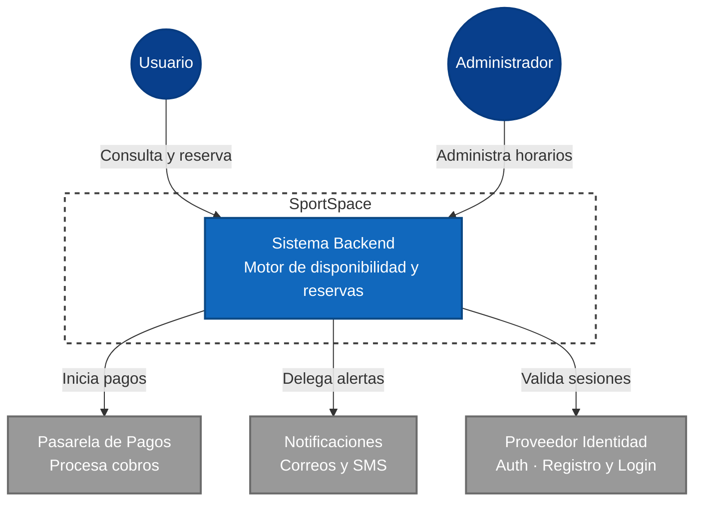
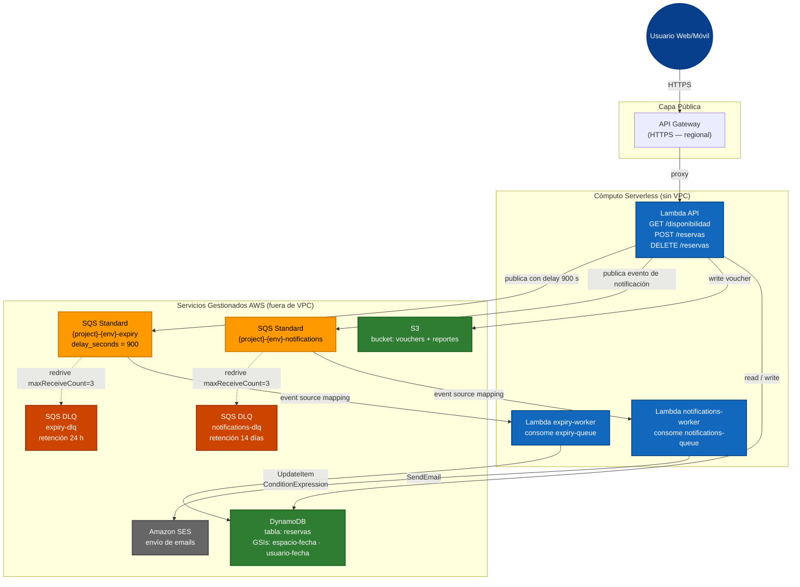
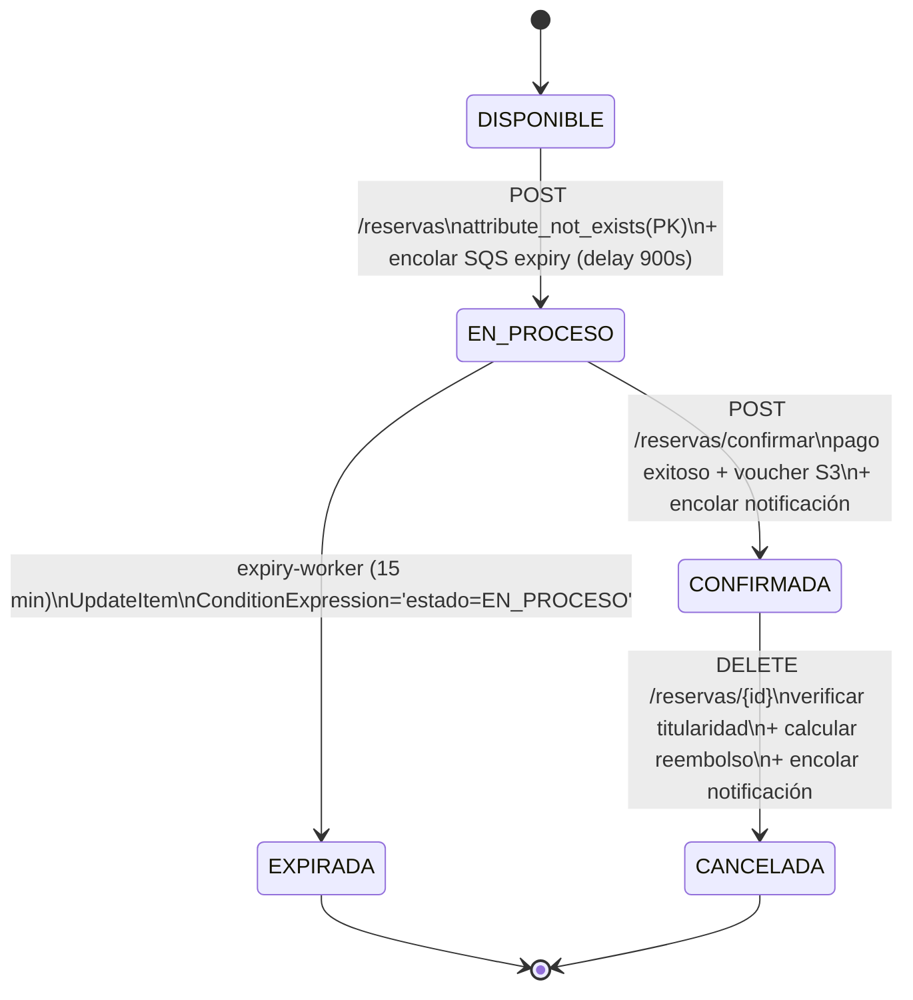

# SportSpace
## Sistema de Reservas y Disponibilidad de Canchas Deportivas y Espacios Recreativos

**Curso:** Infraestructura en la Nube

| **Integrantes** | Douglas Perez · Carlos Daniel Martinez · Ana Isabel Perez |
|---|---|

---

## Tabla de Contenidos

| # | Sección |
|---|---------|
| 0 | [Resumen de Cambios por Entrega](#0-resumen-de-cambios) |
| 1 | [Resumen Ejecutivo](#1-resumen-ejecutivo) |
| 2 | [Actores](#2-actores) |
| 3 | [Casos de Uso Priorizados](#3-casos-de-uso-priorizados) |
| 4 | [Funcionalidades Específicas](#4-funcionalidades-específicas-del-proyecto) |
| 5 | [Mockups](#5-mockups) |
| 6 | [Mapeo a Conceptos del Curso](#6-mapeo-a-conceptos-del-curso) |
| 7 | [Scope del Sistema](#7-scope-del-sistema) |
| 8 | [Diagrama de Contexto](#8-diagrama-de-contexto) |
| 9 | [Decisión de Cómputo](#9-decisión-de-cómputo) |
| 10 | [Modelo de Datos y Almacenamiento](#10-modelo-de-datos-y-almacenamiento) |
| 11 | [Diagrama de Contenedores v1 — E3](#11-diagrama-de-contenedores-v1--track-serverless-only) |
| 12 | [Diagrama de Contenedores v2 — E4](#12-diagrama-de-contenedores-v2--e4) |
| 13 | [Flujos Asíncronos — E4](#13-flujos-asíncronos-e4) |
| 14 | [Diseño de Red — Track Serverless-Only](#14-diseño-de-red--track-serverless-only) |
| 15 | [Preguntas Abiertas](#15-preguntas-abiertas) |
| 16 | [Anexo IA](#16-anexo-ia--uso-de-inteligencia-artificial) |
| 17 | [Detalle del Componente Más Complejo](#17-detalle-del-componente-más-complejo-flujo-de-reserva-con-bloqueo-optimista) |
| 18 | [API Surface](#18-api-surface) |
| 19 | [Modelo de Seguridad](#19-modelo-de-seguridad) |
| 20 | [Plan de Observabilidad](#20-plan-de-observabilidad) |
| 21 | [Estimado de Costo Mensual](#21-estimado-de-costo-mensual) |
| 22 | [Riesgos y Decisiones Pendientes](#22-riesgos-y-decisiones-pendientes) |

---

## 0. Resumen de Cambios

### Iteración E1 → E2

A partir de la retroalimentación obtenida y nuestras discusiones técnicas en la segunda iteración, realizamos los siguientes ajustes respecto a nuestra propuesta inicial en la Entrega 1:
* **Decisión de Cómputo:** Inicialmente no teníamos claro si nos iríamos por contenedores o funciones Serverless. Tras analizar el comportamiento de las reservas (tráfico intermitente y en ráfagas), decidimos descartar los contenedores (que implican pagos por capacidad continua) y elegimos **AWS Lambda**. Esto nos permite mantener los costos bajos durante la fase MVP.
* **Definición del Modelo de Datos:** Pasamos de un concepto ambiguo a un modelo concreto basado en **AWS DynamoDB**. Decidimos abandonar la idea de usar bases de datos relacionales tradicionales porque las consultas que nos interesan (disponibilidad por fecha/cancha y reservas por usuario) pueden resolverse muy bien utilizando un esquema de tabla única y Global Secondary Indexes (GSIs). 
* **Manejo de Archivos:** Nos dimos cuenta de que requeríamos almacenar los comprobantes inmutables generados para los usuarios, por lo que decidimos acoplar un almacenamiento de objetos con **Amazon S3** específicamente para dichos *vouchers*.

### Iteración E2 → E3 (Red — Track Serverless-Only)

El equipo califica para el **track serverless-only**: cómputo en AWS Lambda y datos en DynamoDB, ambos servicios gestionados fuera de VPC. Por eso la entrega de red no incluye VPC ni subnets; en su lugar, el deliverable equivalente es la capa de **Edge & DNS**:
* **Track serverless-only confirmado:** Lambda y DynamoDB no requieren VPC, ENIs ni subnets. No se creó una VPC para SportSpace; la arquitectura es completamente serverless y sin configuración de red privada.
* **Dominio personalizado:** Se configura `grupo2.oyd.solid.com.gt` como endpoint estable de la API, sub-delegado por los instructores. La hosted zone vive en Route 53 (`Z0165481J6MHDXNP4MB4`).
* **TLS automático con ACM:** Certificado regional (`us-east-1`) con `validation_method = "DNS"`. Los registros CNAME de validación se crean en Route 53 vía Terraform; el record `A ALIAS` apunta al custom domain del API Gateway.
* **Custom domain en API Gateway:** El stage `dev` del HTTP API se bindea a `grupo2.oyd.solid.com.gt` vía `aws_apigatewayv2_api_mapping`. La URL default del API GW (`dpx91ti4dc.execute-api.us-east-1.amazonaws.com/dev`) permanece activa como fallback.
* **IAM least-privilege para invocación (Deliverable B):** El `aws_lambda_permission` usa `source_arn = "${execution_arn}/*/*"` — scoped al API Gateway específico de SportSpace. Esto previene que cualquier otro origen invoque la Lambda directamente.
* **Primera versión del diagrama de contenedores:** Muestra el flujo serverless completo: Internet → Route 53 → API Gateway → Lambda → DynamoDB / S3. Sin subnets ni VPC. Se completará en E4 con queues/topics.

### Iteración E3 → E4 (Procesamiento Asíncrono)

Con el diseño de red establecido en E3, en esta iteración incorporamos la capa de procesamiento asíncrono sobre la infraestructura ya definida:
* **Capa asíncrona sobre el diseño de red:** Se agrega la capa asíncrona sin modificar la capa Edge & DNS definida en E3. Las colas SQS y los workers Lambda son servicios gestionados; al estar en el track serverless-only no requieren configuración de red adicional.
* **Diagrama de contenedores actualizado:** El diagrama v2 incluye las colas SQS (`notifications-queue` y `expiry-queue`) y sus workers Lambda que se suman a la arquitectura existente API Gateway → Lambda API → DynamoDB/S3.
* **Pregunta abierta de E3 resuelta:** Se responde la pregunta sobre EventBridge vs SQS. Se eligió SQS por ser la opción más simple para el patrón de un único consumidor por evento, con DLQ nativa y menor costo.

### Iteración E4 → E5 (Seguridad, Observabilidad y Costos)
* **Modelo de seguridad completo:** Se definen roles IAM por servicio con mínimo privilegio, se documenta la estrategia de autenticación JWT vía API Gateway con Cognito, cifrado en tránsito y en reposo.
* **Plan de observabilidad:** Se agregan logs estructurados con correlation IDs, métricas RED para Lambda y SQS, y tres alarmas con threshold y acción definidos.
* **Estimado de costo:** Se calcula el costo mensual para el MVP (~50 reservas/día) usando precios públicos de AWS. Resultado: ~$0.93/mes gracias al Free Tier y las decisiones de diseño previas.
* **Detalle del componente más complejo:** Se documenta el flujo de reserva con bloqueo optimista como diagrama de estados con transiciones explícitas.
* **Preguntas E5 resueltas:** Se responden las preguntas sobre autenticación JWT y estrategia de alarmas para DLQ.

---

## 1. Resumen Ejecutivo

Reservar una cancha de fútbol, básquetbol o tenis en Guatemala implica hoy llamadas telefónicas, mensajes de WhatsApp a grupos informales o presentarse físicamente al lugar para ver si hay espacio disponible. El resultado es predecible: doble reserva del mismo espacio, cancelaciones de último minuto sin aviso, y administradores que pierden horas coordinando manualmente lo que un sistema podría hacer en segundos.

**SportSpace** es un sistema backend que centraliza la disponibilidad en tiempo real de canchas deportivas y espacios recreativos (canchas de fútbol, básquetbol, tenis, pádel, salones multiusos), permite a los usuarios hacer reservas con confirmación inmediata, gestiona cancelaciones con políticas configurables y notifica automáticamente a todas las partes involucradas.

El sistema sirve a dos tipos de organizaciones: complejos deportivos privados (canchas de alquiler) y clubes o asociaciones que administran espacios para sus miembros. En ambos casos, SportSpace elimina la coordinación manual, reduce las cancelaciones sin aviso y genera visibilidad sobre la utilización real de cada espacio.

---

## 2. Actores

### 2.1 Actores Primarios

- **Usuario / Deportista:** Persona que busca disponibilidad, hace una reserva, la modifica o la cancela. Interactúa principalmente a través de una app móvil o web. Espera confirmación inmediata y recordatorios antes de su reserva.
- **Administrador del Complejo:** Persona que gestiona uno o varios espacios deportivos. Configura horarios, precios, bloqueos de mantenimiento y consulta reportes de utilización. Es el cliente principal del sistema.

### 2.2 Actores de Soporte

- **Pasarela de Pagos:** Sistema externo que procesa el pago al momento de confirmar la reserva. El sistema de reservas no almacena datos de tarjeta.
- **Proveedor de Notificaciones:** Servicio externo que entrega correos electrónicos y SMS de confirmación, recordatorio y cancelación.
- **Proveedor de Identidad:** Gestiona autenticación y sesiones de usuarios y administradores, sin que SportSpace maneje contraseñas directamente.

---

## 3. Casos de Uso Priorizados

Se listan 7 user stories ordenadas por prioridad. **P0** = crítico para el sistema; **P1** = importante pero no bloquea el MVP; **P2** = valioso pero diferible.

| ID | Prior. | User Story | Criterio de Éxito | Componente |
|----|--------|------------|-------------------|------------|
| UC-01 | **P0** | Como deportista, quiero ver la disponibilidad de una cancha por fecha y hora para decidir cuándo reservar. | La consulta retorna un resultado libres/ocupados en < 1 s para un día dado. | Cómputo / BD |
| UC-02 | **P0** | Como deportista, quiero reservar una cancha disponible y recibir confirmación inmediata con número de reserva. | La reserva se crea atómicamente; no pueden existir dos reservas para la misma cancha. | Cómputo / BD / Async |
| UC-03 | **P0** | Como deportista, quiero cancelar una reserva y recibir notificación de la política de reembolso aplicable. | La cancelación libera el espacio dentro de 2 s; se dispara notificación al usuario. | Cómputo / Async |
| UC-04 | **P0** | Como administrador, quiero configurar los horarios disponibles y precios por hora de cada cancha. | Los cambios de disponibilidad se reflejan en la vista del deportista en < 30 s. | Cómputo / BD |
| UC-05 | **P1** | Como deportista, quiero recibir un recordatorio 1 día antes de mi reserva para no olvidarla. | El recordatorio llega por email o SMS. | Async / Notificaciones |
| UC-06 | **P1** | Como administrador, quiero bloquear un espacio por mantenimiento sin afectar otras canchas del complejo. | El bloqueo impide nuevas reservas en ese espacio; las existentes se notifican automáticamente. | Cómputo / BD / Async |
| UC-07 | **P2** | Como administrador, quiero ver un reporte de utilización mensual por cancha para tomar decisiones de precio. | El reporte muestra el porcentaje de ocupación en base a día y cantidad de horas. | BD / Almacenamiento |

---

## 4. Funcionalidades Específicas del Proyecto

### 4.1 Motor de Disponibilidad en Tiempo Real

- Consulta de espacios libres considerando: horarios configurados, reservas existentes, bloqueos de mantenimiento y tiempos de limpieza entre reservas.
- Soporte para múltiples tipos de espacio dentro de un mismo complejo.

### 4.2 Reserva con Bloqueo Optimista

- Al iniciar el proceso de reserva, el espacio se marca como "en proceso" por **15 minutos** para evitar que otro usuario lo tome simultáneamente.
- Si el pago no se completa en ese tiempo, el espacio se libera automáticamente.
- Generación de código único de reserva para identificación presencial.

### 4.3 Gestión de Cancelaciones con Políticas

- Política de cancelación configurable por complejo.
- Cuando se cancela un espacio, se dispara evento que puede notificar a usuarios en lista de espera.

### 4.4 Panel de Administración

- Vista de agenda diaria, semanal y mensual por complejo con visualización de espacios: libre (verde), reservado (azul), bloqueado (gris), en proceso (amarillo).
- Configuración de bloqueos por mantenimiento con opción de bloqueo recurrente.
- Dashboard con métricas de uso.

### 4.5 Notificaciones Multi-evento

- Confirmación de reserva.
- Recordatorio 1 día antes de la reserva.
- Aviso de cancelación.
- Notificación cuando un espacio bloqueado vuelve a estar disponible.

---

## 5. Mockups

Los siguientes mockups representan las pantallas principales que cubren los casos de uso priorizados. El objetivo es comunicar flujo e información, no diseño visual final.

### Mockup 1 — Búsqueda de Disponibilidad (UC-01)

```
┌─────────────────────────────────────────────────────┐
│  SportSpace                          [Mi cuenta] [☰] │
├─────────────────────────────────────────────────────┤
│                                                     │
│  Buscar cancha                                      │
│  ┌───────────────┐ ┌──────────┐ ┌───────────────┐  │
│  │ Deporte: Tenis│ │15/05/26  │ │ Zona: Norte   │  │
│  └───────────────┘ └──────────┘ └───────────────┘  │
│                           [  BUSCAR DISPONIBILIDAD ] │
│                                                     │
│  Resultados — Complejo Las Américas, Cancha 3       │
│  ┌──────┬──────┬──────┬──────┬──────┬──────┐       │
│  │ 7:00 │ 8:00 │ 9:00 │10:00 │11:00 │12:00 │       │
│  │ [///]│ [OK] │ [OK] │[////]│ [OK] │[////]│       │
│  └──────┴──────┴──────┴──────┴──────┴──────┘       │
│  [///] = Ocupado    [OK] = Disponible (Q75/hora)    │
└─────────────────────────────────────────────────────┘
```

El usuario selecciona deporte, fecha y zona. El sistema retorna los espacios disponibles del complejo más cercano que tenga el deporte solicitado. Los espacios ocupados se muestran sombreados; al hacer clic en uno disponible, avanza al flujo de reserva.

---

### Mockup 2 — Confirmación de Reserva (UC-02)

```
┌─────────────────────────────────────────────────────┐
│  SportSpace > Reservar                              │
├─────────────────────────────────────────────────────┤
│                                                     │
│  Resumen de tu reserva                              │
│  Complejo: Las Américas, Zona Norte                 │
│  Espacio:  Cancha de Tenis No. 3                    │
│  Fecha:    jueves 15 mayo 2026                      │
│  Horario:  09:00 – 10:00 (1 hora)                   │
│  ─────────────────────────────────────────────────  │
│  Costo: Q75.00    Política: cancelación libre 4h+   │
│  ─────────────────────────────────────────────────  │
│  Método de pago                                     │
│  ● Tarjeta terminada en 4321  ○ Agregar nueva       │
│                                                     │
│             [  CONFIRMAR Y PAGAR Q75.00  ]          │
│                                                     │
│  ** Tienes 15 min para confirmar antes de que el    │
│     espacio se libere. Tiempo restante: 14:38       │
└─────────────────────────────────────────────────────┘
```

El espacio queda en estado "en proceso" durante 15 minutos. La cuenta regresiva es visible. Al confirmar, se invoca el módulo de pagos y, si es exitoso, se genera el número de reserva y se dispara la notificación de confirmación.

---

### Mockup 3 — Voucher de Reserva Confirmada (UC-02)

```
┌─────────────────────────────────────────────────────┐
│  SportSpace                                         │
│                                                     │
│         ✓  Reserva confirmada                       │
│                                                     │
│  Código:   SPT-2026-004821                          │
│  Complejo: Las Américas, Zona Norte                 │
│  Cancha:   Tenis No. 3                              │
│  Cuando:   jueves 15 mayo 2026 · 09:00–10:00        │
│  Pagado:   Q75.00 (Visa *4321)                      │
│                                                     │
│  [ Ver en Calendario ]  [ Cancelar reserva ]        │
│                                                     │
│  Se envió confirmación a: juan@email.com            │
└─────────────────────────────────────────────────────┘
```

El código se usa para identificación presencial. El usuario también recibe el voucher por email. El botón "Cancelar reserva" aplica la política configurada por el administrador.

---

### Mockup 4 — Cancelación de Reserva (UC-03)

```
┌─────────────────────────────────────────────────────┐
│  Cancelar reserva SPT-2026-004821                   │
├─────────────────────────────────────────────────────┤
│                                                     │
│  Tenis No. 3 · 15 mayo 2026 · 09:00–10:00           │
│                                                     │
│  Política de cancelación:                           │
│  ● Antes de hoy 21:00 → Reembolso 100% (Q75.00)     │
│  ○ 14 may 21:00 – 15 may 08:00 → Reembolso 50%      │
│  ○ Después de 15 may 08:00 → Sin reembolso           │
│                                                     │
│  Si cancelas ahora recibirás Q75.00 de vuelta.      │
│                                                     │
│    [ CONFIRMAR CANCELACIÓN ]  [ Volver ]            │
└─────────────────────────────────────────────────────┘
```

El sistema muestra la política vigente calculada desde el momento actual. El reembolso aplica al mismo método de pago original.

---

### Mockup 5 — Agenda del Administrador (UC-04, UC-06)

```
┌─────────────────────────────────────────────────────┐
│  Admin — Complejo Las Américas     [+ Bloqueo] [⚙️] │
├────────┬───────────────┬───────────────┬────────────┤
│ Hora   │  Tenis 1      │  Tenis 2      │  Padel 1   │
├────────┼───────────────┼───────────────┼────────────┤
│ 07:00  │ [Libre]       │ [Libre]       │ [BLOQUEO]  │
│ 08:00  │ [■ Gonzalez]  │ [Libre]       │ [BLOQUEO]  │
│ 09:00  │ [■ Perez]     │ [■ Martinez]  │ [Libre]    │
│ 10:00  │ [Libre]       │ [■ Lopez]     │ [■ Torres] │
│ 11:00  │ [~ En proceso]│ [Libre]       │ [Libre]    │
├────────┴───────────────┴───────────────┴────────────┤
│ [Libre]=verde  [■]=azul(reservado)  [~]=amarillo    │
│ [BLOQUEO]=gris oscuro                               │
└─────────────────────────────────────────────────────┘
```

El administrador puede hacer clic en cualquier espacio libre para crear un bloqueo o una reserva manual. Los bloqueos muestran el motivo al pasar el cursor sobre ellos.

---

### Mockup 6 — Configuración de Cancha (UC-04)

```
┌─────────────────────────────────────────────────────┐
│  Configurar espacio: Tenis No. 3           [Guardar] │
├─────────────────────────────────────────────────────┤
│  Nombre:      [Tenis No. 3          ]               │
│  Tipo:        [Tenis              v ]               │
│  Espacio:     [● 60 min] [○ 30 min] [○ 90 min]      │
│  Limpieza:    [15 min entre reservas          ]     │
│  Precio/hora: [Q75.00            ]                  │
│                                                     │
│  Política de cancelación                            │
│  Libre hasta: [4] horas antes del slot              │
│  Penalidad:   [50]% entre [4] y [1] horas           │
│  Sin reembolso: menos de [1] hora antes             │
└─────────────────────────────────────────────────────┘
```

Cada espacio tiene su propia configuración y política de cancelación. El tiempo de limpieza entre reservas se descuenta automáticamente de la disponibilidad.

---

### Mockup 7 — Mis Reservas (UC-03, UC-05)

```
┌─────────────────────────────────────────────────────┐
│  Mis Reservas                  [Próximas][Historial] │
├─────────────────────────────────────────────────────┤
│                                                     │
│  ┌───────────────────────────────────────────────┐  │
│  │ SPT-2026-004821  ●CONFIRMADA                  │  │
│  │ Tenis No.3 · Las Américas                     │  │
│  │ jue 15 mayo 2026 · 09:00–10:00  · Q75.00      │  │
│  │ [Ver detalle] [Cancelar] [Agregar al cal.]    │  │
│  └───────────────────────────────────────────────┘  │
│                                                     │
│  ┌───────────────────────────────────────────────┐  │
│  │ SPT-2026-004790  ●CONFIRMADA                  │  │
│  │ Futbol 5 · Complejo Norte                     │  │
│  │ sab 17 mayo 2026 · 18:00–19:00  · Q200.00     │  │
│  │ [Ver detalle] [Cancelar] [Agregar al cal.]    │  │
│  └───────────────────────────────────────────────┘  │
│                                                     │
│           [  + NUEVA RESERVA  ]                     │
└─────────────────────────────────────────────────────┘
```

Vista consolidada de todas las reservas activas del usuario. Cada tarjeta muestra el estado visual y las acciones disponibles según política.

---

## 6. Mapeo a Conceptos del Curso

| Componente del Curso | Cómo lo ejercita SportSpace | Caso de Uso relacionado |
|---|---|---|
| **Cómputo (API)** | El endpoint `POST /reservas` recibe la solicitud, aplica el bloqueo optimista de 15 min y desencadena el flujo de pago. El endpoint `GET /disponibilidad/:espacioId/:fecha` retorna espacios obtenidos en tiempo real. | UC-01, UC-02 |
| **Base de datos** | Entidades: Espacio, Reserva, Bloqueo, Complejo, Usuario. Queries críticos: espacios disponibles por fecha (excluir reservas y bloqueos traslapados), reservas activas por usuario, utilización por franja horaria. | UC-01, UC-04, UC-07 |
| **Almacenamiento de archivos** | Vouchers PDF de cada reserva confirmada almacenados en S3. Reportes de utilización mensual generados bajo demanda y guardados como archivos para descarga. | UC-02, UC-07 |
| **Red** | Capa pública: API Gateway + load balancer que recibe requests del FE/móvil. Capa privada: base de datos de reservas y workers de notificaciones, sin exposición directa a internet. | Todos |
| **Procesamiento asíncrono** | (1) Expiración de bloqueos optimistas: evento disparado a los 15 min si el pago no se completa. (2) Envío de notificaciones de confirmación/recordatorio. | UC-02, UC-03, UC-05 |
| **Seguridad** | Solo el titular de una reserva puede cancelarla (validación por JWT + userId). El administrador solo puede gestionar espacios de su complejo. Política de acceso por rol: USER vs ADMIN. | UC-03, UC-04, UC-06 |
| **Observabilidad** | Métrica clave: espacios expirados sin completar pago. Alarma: tasa de error en endpoint de reserva > 1% en 15 min. Log estructurado con reservaId en cada operación. | UC-02 |

---

## 7. Scope del Sistema

### 7.1 IN — Lo que SÍ hace SportSpace

- Consulta de disponibilidad en tiempo real de canchas y espacios registrados.
- Reserva de espacios con bloqueo optimista de 15 minutos durante el proceso de pago.
- Integración con módulo de pagos externo para procesar el cobro.
- Cancelación de reservas con aplicación automática de política de reembolso configurable.
- Notificaciones por email de confirmación, recordatorio y cancelación.
- Panel de administración para configurar espacios, horarios, precios y bloqueos.
- Bloqueos de mantenimiento con notificación a reservas afectadas.
- Reporte de utilización por espacio.

### 7.2 OUT — Lo que SportSpace NO hace (en este diseño)

- El sistema soporta múltiples complejos pero no un modelo de negocio tipo plataforma.
- Lista de espera automatizada.
- Integración con calendarios externos.
- Sistema de puntos, membresías o fidelización.
- Procesamiento de imágenes de las canchas (fotos): se asume que las imágenes son URLs externas.

---

## 8. Diagrama de Contexto

El siguiente diagrama muestra el límite del sistema SportSpace y sus integraciones externas:



---

## 9. Decisión de Cómputo

Elegimos **AWS Lambda** como plataforma de cómputo principal para los endpoints de la API de nuestro sistema.

* **Enfoque Elegido:** Serverless (AWS Lambda usando Python 3.12).
* **Trade-off 1 (Costo por Invocación vs. Costo Constante - Lambda vs ECS Fargate):** Decidimos optar por el esquema Serverless debido a que el tráfico de SportSpace tiende a ser intermitente y presenta ráfagas (reservas que caen de golpe a cierta hora). En lugar de usar ECS Fargate, que requeriría pagar por contenedores encendidos 24/7 escuchando tráfico, aceptamos perder el entorno siempre activo para lograr que nuestro MVP se mantenga dentro del "Free Tier", pagando únicamente cuando hay invocaciones.
* **Trade-off 2 (Simplicidad de Operación vs. Control del Entorno):** Aceptamos perder el control sobre el sistema operativo subyacente y las configuraciones de red internas que tendríamos con instancias EC2 o contenedores, ganando a cambio el no tener que preocuparnos por parches de seguridad, mantenimiento de servidores o configuración de métricas de Auto Scaling.
* **Desventaja Reconocida:** *Cold Starts* (Arranques en frío). Somos conscientes de que, al estar en reposo, la primera invocación a nuestra API de reservas tomará un tiempo extra (típicamente 200-500ms) mientras el contenedor de la Lambda se aprovisiona y levanta el intérprete de Python, lo cual podría degradar levemente la percepción inicial de rendimiento para el primer usuario tras inactividad. 

---

## 10. Modelo de Datos y Almacenamiento

### 10.1 Estructura en Base de Datos (DynamoDB)
Decidimos implementar **AWS DynamoDB** (base de datos NoSQL gestionada) utilizando un esquema de tabla única (Single Table Design) alrededor de la tabla principal `reservas`.

**Patrones de Acceso e Índices que definimos:**
1. **UC-01 (Consultar disponibilidad):** Creamos un GSI (Global Secondary Index) llamado `espacio-fecha-index`. Esto nos permite consultar rápidamente por el ID de la cancha como llave de partición y buscar rangos de tiempo para verificar la disponibilidad real.
2. **UC-03 (Consultar mis reservas):** Creamos un segundo GSI llamado `usuario-fecha-index` para poder recuperar todo el historial y reservas futuras de un deportista en particular.
3. **Reserva atómica y expiración:** Implementamos el atributo `expires_at` que hace uso de la funcionalidad TTL (Time-to-Live) nativa de DynamoDB. Esto nos permite eliminar automáticamente las reservas temporales (lock optimista) si el usuario no concreta el pago en 15 minutos.

**Nota de implementación:** la tabla, ambos GSIs y el TTL están desplegados y activos en AWS (`proyecto-trimestre2-dev-reservas`) como parte del deliverable de infraestructura. Sin embargo, la lógica de negocio de la app (`App/backend`) corre sobre **SQLite/SQLAlchemy**, no contra esta tabla — son dos pistas paralelas: la infraestructura DynamoDB demuestra el patrón de acceso diseñado en esta sección, mientras que la app real (login, reservas, cancelaciones) usa el modelo relacional local. Unificarlas es trabajo pendiente si el proyecto pasa de MVP académico a producción.

### 10.2 Almacenamiento de Objetos (Amazon S3)
* Para cada reserva pagada y confirmada, el sistema genera un **voucher o comprobante** en formato documento/imagen. Decidimos guardar estos datos inmutables en un bucket de **Amazon S3** con reglas de ciclo de vida (vouchers/prefix), segregando claramente los datos estructurados transaccionales de los archivos estáticos.

### 10.3 Caché
* **Decisión de Caché:** Decidimos omitir la implementación de Redis o Memcached en esta etapa. Al tratarse de un sistema de reservas susceptible a colisiones directas (doble *booking*), priorizamos lecturas de consistencia fuerte directamente contra la base de datos maestra para evaluar la disponibilidad en tiempo real, evitando riesgos de overbooking generados por cachés desincronizados.

---

## 11. Diagrama de Contenedores (v1 — Track Serverless-Only)

El siguiente diagrama muestra el flujo completo del sistema en el track serverless-only. No existe VPC ni subnets — todos los componentes son servicios gestionados de AWS. Esta es la versión E3; se extiende en E4 con las colas SQS y workers asíncronos.

```
┌──────────────────────────────────────────────────────────────────────┐
│                            INTERNET                                   │
│   Usuario Web/Móvil ──────────────────────────► HTTPS               │
│   Administrador ──────────────────────────────► HTTPS               │
└──────────────────────────────────┬───────────────────────────────────┘
                                   │
                      DNS: grupo2.oyd.solid.com.gt
                                   │
┌──────────────────────────────────┴───────────────────────────────────┐
│  Cuenta AWS — us-east-1                                               │
│                                                                       │
│  ┌─ Edge & DNS (módulo network/) ──────────────────────────────────┐  │
│  │                                                                 │  │
│  │  Route 53 Hosted Zone                                           │  │
│  │  grupo2.oyd.solid.com.gt  ·  ID: Z0165481J6MHDXNP4MB4          │  │
│  │  Record: A ALIAS → API Gateway custom domain                   │  │
│  │                                                                 │  │
│  │  ACM Certificate  ·  TLS 1.2  ·  validación DNS automática     │  │
│  └──────────────────────────────┬──────────────────────────────────┘  │
│                                 │                                     │
│  ┌─ Ingress (módulo ingress/) ──▼──────────────────────────────────┐  │
│  │                                                                 │  │
│  │  API Gateway HTTP API v2                                        │  │
│  │  ID: dpx91ti4dc  ·  Stage: dev                                  │  │
│  │  Custom domain : https://grupo2.oyd.solid.com.gt               │  │
│  │  Default URL   : https://dpx91ti4dc.execute-api.               │  │
│  │                  us-east-1.amazonaws.com/dev                    │  │
│  │                                                                 │  │
│  │  Rutas: GET /  ·  GET /reservations  ·  POST /vouchers         │  │
│  └──────────────────────────────┬──────────────────────────────────┘  │
│                                 │ Lambda proxy integration             │
│                                 │ (aws_lambda_permission scoped        │
│                                 │  al execution_arn del API GW)        │
│  ┌─ Cómputo (módulo compute/) ──▼──────────────────────────────────┐  │
│  │                                                                 │  │
│  │  Lambda  ·  proyecto-trimestre2-dev-api                        │  │
│  │  Runtime: python3.12  ·  128 MB  ·  30 s timeout               │  │
│  │  IAM exec role: policies inline sin wildcard en Resource        │  │
│  │    - CloudWatch Logs (scoped al log group de esta función)      │  │
│  │    - DynamoDB: GetItem/PutItem/Query/Scan/Update/Delete         │  │
│  │    - S3: PutObject/GetObject/DeleteObject                       │  │
│  └──────────────────┬───────────────────────┬───────────────────────┘  │
│                     │ IAM role policy         │ IAM role policy          │
│                     ▼                         ▼                         │
│  ┌──────────────────────────┐   ┌───────────────────────────────────┐  │
│  │ DynamoDB                 │   │ S3                                │  │
│  │ proyecto-trimestre2      │   │ proyecto-trimestre2-dev-storage   │  │
│  │ -dev-reservas            │   │ SSE-S3  ·  versionado             │  │
│  │ PAY_PER_REQUEST          │   │ Lifecycle: vouchers/ → IA 30d     │  │
│  │ GSI: espacio-fecha-index │   │ Bucket policy: deny non-SSL       │  │
│  │ GSI: usuario-fecha-index │   │                                   │  │
│  │ TTL: expires_at          │   │                                   │  │
│  └──────────────────────────┘   └───────────────────────────────────┘  │
└───────────────────────────────────────────────────────────────────────┘
```

### Decisiones visibles en el diagrama

| Componente | Cómo se conecta | Justificación |
|------------|-----------------|---------------|
| **Route 53 + ACM** | Edge — DNS y TLS | Endpoint estable con dominio personalizado. Sin custom domain, la URL del API Gateway cambia si el recurso se destruye y recrea. ACM elimina la gestión manual de certificados. |
| **API Gateway HTTP API** | Servicio regional gestionado | Único punto de entrada HTTPS. HTTP API v2 es 71 % más barato que REST API v1 ($1/M vs $3.50/M requests) y tiene menor latencia. No reside en la VPC. |
| **Lambda** | Servicio gestionado sin VPC | Invocada exclusivamente por el API Gateway gracias al `aws_lambda_permission` con `source_arn` scoped. Sin ENI, sin cold start de VPC, sin subnets. |
| **DynamoDB** | Acceso directo vía IAM | Servicio gestionado fuera de VPC. El rol de ejecución de la Lambda tiene la política IAM necesaria; no se requiere endpoint de red. |
| **S3** | Acceso directo vía IAM | Igual que DynamoDB. El bucket tiene bucket policy que deniega non-SSL y el acceso está scoped al ARN específico del bucket. |

---

## 12. Diagrama de Contenedores (v2 — E4)

El siguiente diagrama extiende el v1 incorporando las colas SQS, los workers asíncronos y Amazon SES. Los componentes de red del track serverless-only (Route 53, ACM, API Gateway custom domain) no cambian respecto a E3.



---

## 13. Flujos Asíncronos (E4)

### Flujo 1 — Notificaciones

| Campo | Valor |
|-------|-------|
| **Tipo** | Comando |
| **Productor** | Lambda API |
| **Cola** | `{project}-{env}-notifications` (SQS Standard, desplegada como cola independiente de `{project}-{env}-reservations`) |
| **Consumidor** | Lambda `async-consumer` (worker compartido — en este entorno dev procesa ambas colas; el `notifications-worker` dedicado con envío real a SES queda pendiente, ver §22) |
| **Visibility timeout** | 60 s (mayor que el timeout del worker de 30 s) |
| **Manejo de fallos** | `maxReceiveCount = 3` → DLQ con retención 14 días |

**Payload — campos críticos:**

```json
{
  "event_type": "reserva_confirmada | reserva_cancelada | recordatorio_24h | bloqueo_notificado",
  "reserva_id": "<uuid>",
  "usuario_email": "<email>",
  "fecha": "YYYY-MM-DD",
  "hora_inicio": "HH:MM",
  "codigo": "SPT-YYYY-XXXXXX"
}
```

**Eventos que produce:** `reserva_confirmada`, `reserva_cancelada`, `recordatorio_24h`, `bloqueo_notificado`

**Idempotencia:** `reserva_id` como deduplication key. Reenviar el mismo evento no genera email duplicado: el worker verifica el estado de la reserva en DynamoDB antes de invocar SES.

---

### Flujo 2 — Expiración de Bloqueos Optimistas

| Campo | Valor |
|-------|-------|
| **Tipo** | Comando |
| **Productor** | Lambda API (al crear reserva en estado `EN_PROCESO`) |
| **Cola** | `{project}-{env}-reservations` (SQS Standard, `delay_seconds = 900` aplicado en `publish_expiry`) — diseñada como cola `expiry` independiente; en este entorno dev comparte la cola de reservas en vez de tener su propia cola dedicada |
| **Consumidor** | Diseñado como Lambda `expiry-worker` dedicado con `ConditionExpression`. **No implementado en dev:** la expiración real del bloqueo optimista la resuelve `_expire_pending()` de forma síncrona/perezosa en `App/backend/app/routes/reservations.py`, evaluada en cada request — no hay un worker asíncrono escuchando esta cola. Ver riesgo en §22. |
| **Manejo de fallos** | `maxReceiveCount = 5` → DLQ con retención 14 días (config real desplegada, ver `infra/modules/async`) |

**Payload — campos críticos (real, `app/aws/sqs.py:publish_expiry`):**

```json
{
  "reserva_id": "<int>",
  "space_id": "<int>"
}
```

**Idempotencia (diseño objetivo, no implementado):** El worker ejecutaría un `UpdateItem` con `ConditionExpression = 'estado = :en_proceso'`. Si el usuario completó el pago antes de los 15 min, la condición fallaría silenciosamente y el worker confirmaría el mensaje sin reintento. En la implementación real, la idempotencia la da el chequeo de estado dentro de `_expire_pending()` (solo expira reservas que siguen en `PENDING`).

---

### Decisión: SQS sobre EventBridge

**Elegimos SQS** para ambos flujos asíncronos con base en los siguientes criterios:

| Criterio | SQS (elegido) | EventBridge |
|----------|--------------|-------------|
| **Fan-out** | 1 consumidor por cola — no necesitamos fan-out | Diseñado para múltiples consumidores por evento |
| **Reintentos / DLQ** | Nativos: `maxReceiveCount` + DLQ sin configuración adicional | Requiere definir retry policy por separado |
| **Delay nativo** | `delay_seconds` hasta 900 s — cubre exactamente los 15 min de bloqueo | Requiere EventBridge Scheduler o Step Functions para delays |
| **Costo** | ~$0.40 por millón de mensajes | ~$1.00 por millón de eventos |
| **Complejidad** | Trigger directo Lambda ← SQS (event source mapping) | Requiere event bus, rules y targets |

**Desventaja reconocida:** Si en el futuro se necesitan múltiples consumidores por evento (analytics, push notifications, audit), se migrará a SNS → SQS fan-out o EventBridge.

---

## 14. Diseño de Red — Track Serverless-Only

### 14.1 Rationale del Track

SportSpace califica para el **track serverless-only** porque tanto el cómputo (AWS Lambda) como los datos (Amazon DynamoDB) son servicios gestionados que operan fuera de VPC. Esto significa que **no se crea ninguna VPC** para SportSpace en este proyecto. El deliverable equivalente al diseño de red es la capa **Edge & DNS**.

**Por qué no aplica VPC:**
- Lambda sin VPC tiene cold starts menores (sin delay de ENI), menor configuración y cero costo de networking.
- DynamoDB y S3 son servicios regionales gestionados: la Lambda los alcanza directamente con el IAM role, sin necesidad de endpoints de red privados.
- El acceso está controlado exclusivamente por políticas IAM con least-privilege, que es más seguro y auditable que Security Groups.

### 14.2 Edge & DNS

El módulo `infra/modules/network/` implementa los tres recursos del deliverable Edge & DNS:

| Recurso | Valor desplegado |
|---------|-----------------|
| **Route 53 Hosted Zone** | `grupo2.oyd.solid.com.gt` · ID: `Z0165481J6MHDXNP4MB4` |
| **NS del dominio** | `ns-1941.awsdns-50.co.uk`, `ns-610.awsdns-12.net`, `ns-1154.awsdns-16.org`, `ns-222.awsdns-27.com` |
| **ACM Certificate** | `grupo2.oyd.solid.com.gt` · regional `us-east-1` · TLS 1.2 · validación DNS |
| **API Gateway Custom Domain** | `grupo2.oyd.solid.com.gt` → stage `dev` del HTTP API `dpx91ti4dc` |
| **Record A ALIAS** | `grupo2.oyd.solid.com.gt` → `target_domain_name` del custom domain |

**Estrategia ACM:** El certificado usa `validation_method = "DNS"`. Los registros CNAME de validación se crean en la hosted zone de Route 53 vía `aws_route53_record` y se espera la emisión con `aws_acm_certificate_validation`. El proceso es completamente automatizado por Terraform.

**Endpoints resultantes:**

| Tipo | URL |
|------|-----|
| Custom domain (estable) | `https://grupo2.oyd.solid.com.gt` |
| API Gateway default (fallback) | `https://dpx91ti4dc.execute-api.us-east-1.amazonaws.com/dev` |

### 14.3 IAM Least-Privilege para Invocación (Deliverable B)

El recurso `aws_lambda_permission` en `modules/network/main.tf` controla quién puede invocar la Lambda:

```hcl
resource "aws_lambda_permission" "api_gateway_invoke" {
  statement_id  = "AllowAPIGatewayInvoke"
  action        = "lambda:InvokeFunction"
  function_name = var.lambda_function_name
  principal     = "apigateway.amazonaws.com"
  source_arn    = "${var.api_gateway_execution_arn}/*/*"
}
```

El `source_arn` está scoped al execution ARN del API Gateway específico de SportSpace. Esto previene que cualquier otra fuente (otra API Gateway, invocación directa por ARN) pueda ejecutar la Lambda. Solo el API Gateway de SportSpace puede invocarla.

### 14.4 Trade-off 1 — HTTP API vs REST API

| Criterio | HTTP API v2 (elegido) | REST API v1 |
|----------|-----------------------|-------------|
| **Costo** | $1.00 por millón de requests | $3.50 por millón — 3.5× más caro |
| **Latencia** | ~10-20 ms menor overhead | Mayor overhead de procesamiento |
| **Lambda proxy** | Payload format v2.0 (más limpio) | Payload format v1.0 |
| **Features no disponibles** | AWS WAF nativo, usage plans, API keys | Disponibles |
| **Decisión** | Para MVP sin WAF ni monetización por API key, HTTP API es suficiente. Si en E5 se requiere WAF, se puede colocar CloudFront delante del HTTP API. | — |

### 14.5 Trade-off 2 — Dominio Personalizado vs URL Default del API Gateway

| Criterio | Custom Domain (elegido) | URL Default del API GW |
|----------|-------------------------|------------------------|
| **Estabilidad** | Estable aunque se destruya y recree el API GW | Cambia si el API GW es recreado |
| **TLS** | Certificado propio gestionado con ACM | TLS gestionado por AWS, pero no personalizable |
| **Complejidad** | Requiere Route 53 + ACM + api mapping | Ninguna |
| **Decisión** | La estabilidad del endpoint justifica la complejidad. En un sistema de reservas, el frontend y las integraciones no deben cambiar su URL base cuando se recrea infraestructura. | — |

**Flujo de tráfico end-to-end (serverless-only):**
```
Usuario → HTTPS → DNS: grupo2.oyd.solid.com.gt
                       │
                  Route 53 A-ALIAS
                       │
              API Gateway HTTP API v2
              (stage dev, custom domain)
                       │
              Lambda proxy integration
              (aws_lambda_permission scoped)
                       │
           ┌───────────┴───────────┐
           ▼                       ▼
        DynamoDB                   S3
  (proyecto-trimestre2        (proyecto-trimestre2
    -dev-reservas)               -dev-storage)
  acceso por IAM role          acceso por IAM role
```

---

## 15. Preguntas Abiertas

Las siguientes preguntas permanecen abiertas. Se espera que se resuelvan en entregas posteriores conforme se cubran los temas técnicos correspondientes.

### 15.1 Preguntas de Producto

- **¿Cómo se maneja un complejo con decenas de canchas?** ¿La vista de agenda del admin es viable con 20+ espacios simultáneos? ¿Se necesita paginación o filtros adicionales?
- **¿Reservas grupales o por equipo?** El diseño actual asume una reserva = un usuario. ¿Se requiere asignar múltiples personas a una misma reserva?

### 15.2 Preguntas Técnicas

- **[E3 — Red]:** ~~¿Cómo estructuraremos la VPC interconectando la API Gateway con Lambda y DynamoDB de forma segura?~~ **Resuelto en esta entrega.** El equipo califica para el track serverless-only: sin VPC ni subnets. La capa de red se implementó como Edge & DNS: dominio `grupo2.oyd.solid.com.gt` con Route 53 + ACM + custom domain en API Gateway. El acceso a DynamoDB y S3 es directo por IAM role, sin endpoints de red.
- **[E4 — Asíncrono]:** ~~Mecanismo exacto para notificaciones y expiración de bloqueos (EventBridge vs SQS). ¿Cómo afecta el track serverless-only a la capacidad de Lambda para invocar servicios externos como SES?~~ **Resuelto en esta entrega.** Se eligió SQS Standard con DLQ. Al estar en el track serverless-only sin VPC, el worker Lambda accede a SES directamente por IAM role — sin configuración de red adicional.
- **[E5 — Asíncrono (nuevas)]:**
  - ¿Cómo verificar el email del usuario en SES antes de enviar? ¿Se usa SES sandbox con identidades verificadas o se solicita salida de sandbox desde el inicio del proyecto?
  - ¿Qué métrica de alarma usar para la DLQ? ¿`ApproximateNumberOfMessagesVisible > 0` en CloudWatch es suficiente, o conviene una alarma con período más largo para evitar falsos positivos por mensajes en tránsito?
- **[E5 — Autenticación]:** ~~Estrategia JWT: ¿validado en API Gateway o en Lambda? ¿Cognito o Auth0?~~ **Resuelto.** JWT validado en API Gateway mediante JWT Authorizer nativo con Amazon Cognito User Pool. Lambda recibe el contexto ya validado sin re-validar el token.
- **[E5 — Alarmas DLQ]:** ~~¿`ApproximateNumberOfMessagesVisible > 0` es suficiente?~~ **Resuelto.** Sí, con ventana de 5 min. Para evitar falsos positivos por mensajes en tránsito se usa período de 5 min en lugar de 1 min.
- **[E5 — Costos]:** ~~Estimado de costo mensual para ~50 reservas/día.~~ **Resuelto.** ~$0.93/mes. Ver sección 21.

---

## 16. Anexo IA — Uso de Inteligencia Artificial

Este anexo documenta el uso de herramientas de IA durante la elaboración del proyecto, conforme a la política del curso.

### 16.1 E1 — Scope y Mockups

- **Qué le pedimos a la IA (Claude, Sonnet 4.6):** Proponer casos de uso priorizados, sugerir criterios de éxito, generar mockups y redactar el scope.
- **Qué aceptamos sin cambios:** Mockups como punto de visual funcional y la mayoría de preguntas de contexto futuro.
- **Qué editamos:** Redujimos historias de 10 a 7, e incorporamos el "bloqueo optimista" de 15 minutos en la reserva en vez del valor mínimo propuesto.
- **Qué descartamos:** Sistema de reseñas de canchas (fuera de scope), mapa con Google Maps (evitando dependencias prescindibles) y descartamos la arquitectura por microservicios en favor de una monolítica Serverless controlada.

### 16.2 E2 — Cómputo y Datos

- **Analizar Trade-offs:** Utilizamos la IA para validar nuestras hipótesis sobre ECS Fargate frente a Lambda. Le planteamos nuestro escenario de tráfico en ráfagas para el MVP, y utilizamos su análisis para confirmar las ventajas del esquema de facturación "pago por uso" del Free Tier de Lambda frente a la carga continua de un contenedor inactivo.
- **Diseño del Modelo NoSQL:** Le pedimos a la IA evaluar nuestro planteamiento para modelar un dominio tradicionalmente relacional usando Single Table Design. La IA nos ayudó a confirmar la pertinencia técnica de los GSIs (`espacio-fecha-index` y `usuario-fecha-index`), dándonos seguridad de que con DynamoDB eliminaríamos cuellos de botella por JOINs para nuestros patrones principales (disponibilidad y listado de historial).

### 16.3 E3 — Red (Track Serverless-Only)

- **Qué le pedimos:** Confirmar si el equipo calificaba para el track serverless-only dado que usamos Lambda y DynamoDB; validar la decisión de no crear VPC; comparar HTTP API v2 vs REST API v1 para nuestro caso de uso; revisar el diseño de Edge & DNS con Route 53 + ACM + custom domain en API Gateway.
- **Qué aceptamos:** La confirmación de que Lambda + DynamoDB sin VPC es el enfoque correcto para serverless-only, y que el `aws_lambda_permission` con `source_arn` scoped al execution ARN específico del API Gateway es el control de seguridad adecuado para el deliverable B de least-privilege.
- **Qué editamos:** La IA inicialmente sugirió configurar VPC + subnets para mayor "aislamiento". El equipo descartó esa recomendación porque agrega complejidad de ENI, costo de NAT Gateway y cold starts adicionales sin beneficio real en un stack serverless donde DynamoDB y S3 son servicios externos a la VPC de todas formas.
- **Qué descartamos:** La sugerencia de agregar AWS WAF directamente al API Gateway. Se evaluó como válida para producción pero excesiva para el MVP académico; si se requiere en E5, se añade CloudFront delante del HTTP API.

### 16.4 E4 — Procesamiento Asíncrono

- **Qué le pedimos:** Validar la elección de SQS vs EventBridge para nuestro patrón de un consumidor por evento; confirmar que `delay_seconds = 900` es el mecanismo correcto para implementar el bloqueo optimista de 15 min sin Lambda Scheduler; revisar la estrategia de idempotencia con `ConditionExpression`.
- **Qué aceptamos:** La confirmación de que SQS con delay es más simple que EventBridge Scheduler para el caso del bloqueo optimista: no requiere recursos adicionales ni lógica de programación de eventos; el delay nativo de SQS cubre exactamente los 900 s requeridos.
- **Qué editamos:** La distinción entre evento y comando — la IA los trataba como sinónimos en los payloads. El equipo los diferenció explícitamente: los mensajes en nuestras colas son **comandos** (instrucciones dirigidas a un consumidor conocido), no eventos de dominio de broadcast.
- **Qué descartamos:** La sugerencia de usar EventBridge Pipes para conectar DynamoDB Streams con SQS y disparar la expiración reactivamente desde cambios de estado en DynamoDB. Consideramos innecesaria esa complejidad para el MVP: DynamoDB Streams añade latencia variable y acopla la expiración al modelo de datos; el delay de SQS es más predecible y directo.

### 16.5 E5 — Seguridad, Observabilidad y Costos

- **Qué le pedimos:** Validar el modelo IAM de mínimo privilegio por servicio; confirmar que las métricas RED son las adecuadas para Lambda + SQS; calcular el estimado de costo mensual con los precios públicos de AWS; revisar la elección de Cognito sobre Auth0.
- **Qué aceptamos:** La estructura de la tabla de roles IAM y la lógica de las alarmas de DLQ como señal de fallos acumulados.
- **Qué editamos:** El estimado de costo — la IA calculó un valor más alto porque asumió tráfico continuo de 24h; el equipo ajustó con los supuestos reales del MVP (tráfico en ráfagas, no constante) y aplicó correctamente los Free Tiers.
- **Qué descartamos:** La sugerencia de agregar AWS X-Ray para tracing distribuido — consideramos que CloudWatch Logs con `reserva_id` como correlation ID es suficiente para el MVP. X-Ray agrega costo (~$5/mes por millón de trazas) y complejidad de instrumentación innecesarios en esta etapa.
- **Reflexión final sobre IA en el proyecto:** La IA aceleró significativamente el trabajo en borradores, validación de trade-offs y estructuración de tablas. Las decisiones más importantes del proyecto — Lambda sobre Fargate, track serverless-only, SQS sobre EventBridge, VPC Endpoints sobre NAT Gateway — las tomó el equipo basándose en el análisis de costo y los patrones de acceso reales de SportSpace. La IA se usó para confirmar y explorar alternativas, no para decidir. El mayor aprendizaje fue aprender a editar activamente lo que produce la IA para que refleje las restricciones reales del proyecto en lugar de soluciones genéricas de "best practices".

---

## 17. Detalle del Componente Más Complejo: Flujo de Reserva con Bloqueo Optimista

El componente más complejo de SportSpace combina escritura atómica, bloqueo temporal, confirmación de pago y expiración asíncrona. A continuación se documenta como diagrama de estados y flujo paso a paso.

### 17.1 Diagrama de Estados



### 17.2 Flujo Paso a Paso

1. **POST /reservas** → la Lambda API verifica disponibilidad con una lectura de **consistencia fuerte** en DynamoDB (sin caché, para evitar overbooking — ver decisión en sección 10.3).
2. **Escritura condicional `attribute_not_exists(PK)`** — si otro usuario reservó el mismo slot en el mismo instante, DynamoDB rechaza la escritura con `ConditionalCheckFailedException` y la Lambda responde `409 Conflict`.
3. Si la escritura es exitosa, se encola un mensaje en **SQS expiry** con `delay_seconds = 900` (15 min).
4. La Lambda retorna `reserva_id` y `expires_at` al frontend, que muestra el countdown de 15 minutos (Mockup 2).
5. **POST /reservas/confirmar** → si el pago es exitoso, la Lambda actualiza el estado a `CONFIRMADA`, genera el voucher en S3 y encola el evento `reserva_confirmada` en SQS notifications.
6. Si el usuario **no confirma**: tras los 900 s, el `expiry-worker` recibe el mensaje y ejecuta `UpdateItem` con `ConditionExpression = 'estado = :en_proceso'`, liberando el slot.
7. **Idempotencia garantizada:** si el usuario pagó antes de los 15 min, la condición del paso 6 falla silenciosamente (`ConditionalCheckFailedException`) — el worker la captura y confirma el mensaje sin error ni doble actualización.

---

## 18. API Surface

| Método | Recurso | Autenticación | Request Body (campos críticos) | Respuestas posibles |
|---|---|---|---|---|
| GET | `/disponibilidad/{espacioId}/{fecha}` | JWT Bearer | — | `200` lista de slots / `404` espacio no existe |
| POST | `/reservas` | JWT Bearer | `espacio_id, usuario_id, fecha, hora_inicio` | `201` EN_PROCESO con `expires_at` / `409` slot ocupado |
| POST | `/reservas/confirmar` | JWT Bearer | `reserva_id, usuario_id` | `200` CONFIRMADA con `voucher_url` / `410` expiró / `402` pago fallido |
| DELETE | `/reservas/{reservaId}?usuario_id=` | JWT Bearer + ownership check | — | `200` CANCELADA con `reembolso_pct` / `403` no es el titular |
| GET | `/reservas/usuario/{usuarioId}` | JWT Bearer + mismo usuario | — | `200` lista de reservas activas |
| POST | `/admin/bloqueos` | JWT Bearer + rol ADMIN | `espacio_id, fecha, hora_inicio, hora_fin, motivo` | `201` bloqueo creado / `403` no es admin |
| GET | `/admin/agenda/{complejoId}/{fecha}` | JWT Bearer + rol ADMIN | — | `200` agenda del día |

**Autenticación:** Diseño original con Cognito + JWT Authorizer en API Gateway (ver §19.2). Implementación real en dev: JWT propio validado dentro de FastAPI/Lambda, sin Cognito.

**Escalado:** Lambda escala automáticamente hasta 1,000 concurrencias. API Gateway tiene un throttling por defecto de 10,000 req/s. Para el MVP (~50 reservas/día) no se requiere configuración adicional. Si se crece a múltiples complejos, se revisará en producción.

---

## 19. Modelo de Seguridad

### 19.1 Roles IAM por Servicio

| Rol | Servicio | Acciones | Resource |
|---|---|---|---|
| `lambda-api-exec-role` | Lambda API | dynamodb: GetItem, PutItem, UpdateItem, DeleteItem, Scan, Query | ARN exacto de la tabla + `/index/*` |
| `lambda-api-exec-role` | Lambda API | s3: PutObject, GetObject, DeleteObject | `arn:aws:s3:::proyecto-trimestre2-itoyd-dev-storage/*` |
| `lambda-api-exec-role` | Lambda API | sqs: SendMessage, GetQueueAttributes | ARN de notifications-queue y expiry-queue |
| `lambda-api-exec-role` | Lambda API | logs: CreateLogGroup, CreateLogStream, PutLogEvents | ARN del log group específico de la función |
| `worker-exec-role` | Lambda workers | sqs: ReceiveMessage, DeleteMessage, GetQueueAttributes | ARN de las colas que consume cada worker |
| `worker-exec-role` | Lambda workers | dynamodb: UpdateItem, GetItem, Query | ARN exacto de la tabla |
| `worker-exec-role` | Lambda workers | ses: SendEmail, SendRawEmail | `*` (SES no soporta scoping por destinatario) |

Ningún rol tiene `AdministratorAccess` ni `Resource: "*"`, excepto SES por limitación del servicio.

### 19.2 Autenticación

**Diseño original (E5):** JWT emitido por Amazon Cognito User Pool, validado en API Gateway vía JWT Authorizer antes de invocar Lambda.

**Implementación real (dev):** No se desplegó Cognito (no existe ningún User Pool en la cuenta). La app emite y valida su propio JWT con `python-jose` (`App/backend/app/auth.py`), firmado con un `SECRET_KEY` — leído desde Secrets Manager (`proyecto-trimestre2-dev-jwt-secret-v2`) en el Lambda demo, o desde variable de entorno en local. La validación ocurre dentro de FastAPI, no en API Gateway. Roles `USER`/`ADMIN` se modelan como columna en la tabla `users` (SQLite/SQLAlchemy), no como grupos de Cognito. Se documenta como decisión de alcance para el MVP académico, no como pendiente — migrar a Cognito es trabajo futuro si el proyecto pasa a producción.

### 19.3 Secretos

No hay secretos de base de datos (DynamoDB usa IAM roles). El único secreto es la identidad — gestionada por Cognito. No se almacenan contraseñas en el sistema.

### 19.4 Cifrado

- **En tránsito:** HTTPS en todos los endpoints (TLS 1.2+), certificado ACM en `grupo2.oyd.solid.com.gt`.
- **En reposo:** DynamoDB con KMS CMK (`aws_kms_key.main`), S3 con SSE-KMS (actualizado en D5 desde el SSE-S3/AES-256 original de D2 — mismo CMK que protege Secrets Manager), SQS con SSE-SQS.

---

## 20. Plan de Observabilidad

### 20.1 Logs Estructurados

Cada invocación de Lambda emite JSON con campos: `reserva_id`, `usuario_id`, `accion`, `duracion_ms`, `estado_resultado`, `timestamp`. El `reserva_id` actúa como correlation ID para trazar una reserva a través de Lambda API → SQS → workers en CloudWatch Logs Insights.

### 20.2 Métricas RED

| Servicio | Rate | Errors | Duration |
|---|---|---|---|
| Lambda API | `Invocations` por minuto | `Errors` + `Throttles` | `Duration` p50 y p99 |
| Lambda workers | `Invocations` por minuto | `Errors` | `Duration` p99 |
| SQS notifications | `NumberOfMessagesSent` | `ApproximateNumberOfMessagesNotVisible` | — |
| SQS expiry | `NumberOfMessagesSent` | `ApproximateNumberOfMessagesNotVisible` | — |
| DynamoDB | `SuccessfulRequestLatency` | `SystemErrors` | `SuccessfulRequestLatency` p99 |

### 20.3 Alarmas

Alarmas reales desplegadas (`infra/modules/observability/main.tf`):

| Alarma | Métrica | Threshold | Ventana | Acción |
|---|---|---|---|---|
| `proyecto-trimestre2-dev-api-5xx` | `5xxError` (API Gateway) | > `alarm_error_threshold` | `alarm_period_seconds` × `alarm_evaluation_periods` | SNS → email al equipo |
| `proyecto-trimestre2-dev-async-consumer-errors` | `Errors` (Lambda `async-consumer`) | > 0 | 1 período | SNS → email al equipo |
| `proyecto-trimestre2-dev-dlq-notifications` | `ApproximateNumberOfMessagesVisible` en la DLQ de `notifications` | > 0 | 5 min | SNS → email — indica notificaciones fallidas tras `maxReceiveCount` |

**Pendiente:** alarma equivalente para la DLQ de la cola `reservations` (que cumple el rol de `expiry` en dev) — no implementada aún, mismo patrón que `dlq-notifications`.

### 20.4 Comportamiento ante Degradación de DynamoDB

Si DynamoDB no responde, la Lambda retorna `HTTP 503` al usuario. Los mensajes en SQS que fallen por DynamoDB caído se reintentan 3 veces automáticamente y luego van a DLQ. Las alarmas de DLQ alertan al equipo. Al recuperarse DynamoDB, se procesan manualmente los mensajes en DLQ desde la consola de AWS.

---

## 21. Estimado de Costo Mensual

**Supuestos:** 1 complejo, ~50 reservas/día (~1,500 reservas/mes), ~5,000 invocaciones Lambda/mes (incluye consultas de disponibilidad), ambiente dev en `us-east-1`.

| Servicio | Uso estimado | Costo mensual |
|---|---|---|
| Lambda (API + workers) | ~5,000 invocaciones × 128MB × 1s | ~$0.00 (Free Tier: 1M invocaciones gratis) |
| DynamoDB PAY_PER_REQUEST | ~15,000 lecturas + ~5,000 escrituras | ~$0.02 |
| S3 Standard | ~1,500 objetos × 10KB | ~$0.01 |
| SQS | ~5,000 mensajes/mes | ~$0.00 (Free Tier: 1M mensajes gratis) |
| API Gateway HTTP API | ~5,000 requests/mes | ~$0.00 (Free Tier: 1M requests gratis) |
| Route 53 hosted zone | 1 zona activa | $0.50 |
| ACM certificado | 1 certificado regional | $0.00 |
| Amazon SES | ~1,500 emails/mes | ~$0.15 |
| CloudWatch Logs | ~500MB logs/mes | ~$0.25 |
| Cognito User Pool | < 50,000 MAU | $0.00 (Free Tier) |
| **Total estimado** | | **~$0.93/mes** |

**Nota:** El costo casi cero se debe al Free Tier de AWS y a las decisiones de diseño: Lambda sobre EC2/Fargate, PAY_PER_REQUEST sobre Provisioned Capacity, VPC Endpoints sobre NAT Gateway (track serverless-only elimina incluso ese costo). En producción con múltiples complejos (~500 reservas/día) el estimado sería ~$15–25/mes.

---

## 22. Riesgos y Decisiones Pendientes

| Riesgo | Probabilidad | Impacto | Mitigación |
|---|---|---|---|
| Cold start de Lambda en hora pico | Media | Bajo (200–500ms extra para primer usuario) | Provisioned Concurrency en ventanas 7–9h y 17–20h si métricas muestran quejas |
| SES no desplegado — no existen identidades verificadas en la cuenta | Alta (en dev) | Medio — ninguna notificación se envía hoy, ni siquiera en sandbox | Pendiente real, no solo de sandbox: crear identidad SES verificada y el Lambda `notifications-worker` que la invoque. La cola `notifications` y su consumidor ya existen; falta el envío de email en sí |
| Cognito no desplegado — auth real es JWT propio, no Cognito | Media | Bajo en dev (funciona igual para el MVP); alto si se reutiliza este código en producción sin revisar | Decisión documentada de alcance (§19.2). Migrar a Cognito + JWT Authorizer en API Gateway si el proyecto avanza a producción |
| Expiración de bloqueo optimista es síncrona, no asíncrona | Media | Bajo — funciona igual para el usuario, pero solo libera el slot cuando alguien hace otra request, no exactamente a los 15 min si no hay tráfico | Construir el Lambda `expiry-worker` con `ConditionExpression` sobre DynamoDB, consumiendo la cola ya existente (`reservations`, con `delay_seconds=900`) |
| DynamoDB hot partition si un espacio es muy popular | Baja | Alto — throttling en ese espacio | El partition key `ESPACIO#<id>` distribuye bien entre múltiples espacios; monitorear con CloudWatch `ThrottledRequests` |
| Pérdida de mensajes en DLQ sin revisión | Media | Medio — notificaciones perdidas o bloqueos no liberados | Las alarmas de DLQ alertan en < 5 min; procedimiento manual documentado para redriving desde consola |