# Infraestructura con Terraform — proyecto-trimestre2-itoyd

## SportSpace — Sistema de Reservas de Canchas Deportivas

Este directorio contiene la configuración de Terraform que aprovisiona infraestructura en AWS para el proyecto SportSpace. Cubre los 5 deliveries del curso, incluyendo seguridad, observabilidad y despliegue one-click.

---

## Estructura del Proyecto

```
infra/
├── provider.tf            # Proveedor AWS y restricciones de versión
├── backend.tf             # Backend S3 + DynamoDB para remote state
├── variables.tf           # Variables de entrada (todos los deliveries)
├── main.tf                # Recursos raíz y módulos (D1-D5)
├── outputs.tf             # Valores de salida
├── envs/                  # Configuración por ambiente
│   ├── dev/
│   │   ├── dev.tfvars
│   │   └── backend-dev.hcl
│   └── staging/
│       ├── staging.tfvars
│       └── backend-staging.hcl
├── modules/               # Módulos reutilizables
│   ├── iam/               # D5 — IAM Security Module
│   ├── compute/           # D2/D4 — API Lambda + Async Consumer
│   ├── storage/           # D2 — S3 bucket
│   ├── database/          # D2 — DynamoDB
│   ├── ingress/           # D3 — API Gateway HTTP API
│   ├── network/           # D3 — DNS + Custom Domain + TLS
│   ├── async/             # D4 — SQS + DLQ
│   ├── scheduler/         # D4 — EventBridge Scheduler
│   └── observability/     # D5 — CloudWatch + SNS + Dashboard + Budget
├── seed/                  # D3 — Seed data en DynamoDB
├── bootstrap/             # D1 — Remote state backend
├── docs/                  # Resúmenes por delivery
├── evidence/              # Evidencias para cada delivery
└── README.md
```

---

## Prerrequisitos

| Herramienta | Versión mínima |
|---|---|
| Terraform | ~> 1.8 |
| AWS CLI | 2.x (opcional) |

---

## Configuración de Credenciales AWS

**Importante:** Desde Delivery 5, la autenticación CI usa **OIDC federation** — no se requieren long-lived credentials. Para ejecución local:

```bash
export AWS_ACCESS_KEY_ID="TU_ACCESS_KEY"
export AWS_SECRET_ACCESS_KEY="TU_SECRET_KEY"
export AWS_REGION="us-east-1"
```

---

## Inicializar Terraform

```bash
cd infra
terraform init -backend-config=envs/dev/backend-dev.hcl
```

---

## Plan

```bash
terraform plan -var-file="envs/dev/dev.tfvars" -out=tfplan-dev
```

---

## Apply

```bash
terraform apply tfplan-dev
```

---

## Destroy

```bash
terraform destroy -var-file="envs/dev/dev.tfvars"
```

> **Importante:** No ejecutar `terraform destroy` en `infra/bootstrap/` — el remote state es necesario.

---

## Runbook — Despliegue One-Click (Deliverable F)

### 1. Permisos de cuenta requeridos

- Acceso a AWS con permisos para crear los recursos listados en `infra/docs/iac-coverage.md`
- Presupuesto habilitado en AWS (necesario para `aws_budgets_budget`)
- Dominio Route53 configurado: `proyecto.grupo2.oyd.solid.com.gt` (sub-delegado por instructores)

### 2. GitHub Environments y Secrets

| Secret | Descripción |
|---|---|
| `CI_RUNNER_ROLE_ARN` | ARN del rol CI creado por Terraform en el primer apply manual (`terraform output ci_runner_role_arn`) |

**Entornos configurados:**
- `dev` — sin approval gate, despliegue automático al merge a main
- `staging` — requiere 1 approval manual después de apply en dev

**Credenciales eliminadas** (ya no se usan con OIDC):
- ~~`AWS_ACCESS_KEY_ID`~~
- ~~`AWS_SECRET_ACCESS_KEY`~~
- ~~`DEV_SECRET_KEY` / `STAGING_SECRET_KEY`~~

### 3. Comandos para trigger el pipeline

```bash
# Clonar repositorio
git clone https://github.com/itoyd/proyecto-trimestre2-itoyd.git
cd proyecto-trimestre2-itoyd

# (Opcional) Primera vez — hacer un primer apply manual para crear el CI runner role
cd infra
terraform init -backend-config=envs/dev/backend-dev.hcl
terraform apply -var-file=envs/dev/dev.tfvars
terraform output ci_runner_role_arn   # Copiar este ARN a GitHub Secrets

# Push a main para trigger el pipeline completo
git checkout -b feature/cambio
echo "# cambio" >> infra/main.tf
git add .
git commit -m "trigger deploy"
git push origin feature/cambio
# Crear PR → merge a main → pipeline CD inicia automáticamente
```

### 4. Verificación

```bash
cd infra
terraform output
```

Todos los outputs deben mostrar valores no nulos para los 7 componentes:
- `bucket_name`, `storage_bucket_name` (storage)
- `lambda_function_arn`, `async_consumer_function_arn` (compute)
- `database_table_name`, `database_table_arn` (database)
- `api_custom_endpoint`, `hosted_zone_id` (networking)
- `async_queue_arn`, `async_dlq_arn` (async)
- `compute_role_arn`, `ci_runner_role_arn` (security/IAM)
- `dashboard_name`, `sns_topic_arn` (observability)

---

## Pipeline de CI/CD

### PR Validation (`pr-plan.yml`)

Trigger: Pull request a `main`. Ejecuta:
1. `terraform fmt --check -recursive`
2. `terraform init -backend=false` + `terraform validate`
3. `terraform plan` para dev y staging (sube artifacts)
4. Comenta el resultado del plan en el PR

### CD Apply (`cd-apply.yml`)

Trigger: Push a `main`. Ejecuta en secuencia:
1. **dev:** `terraform init` → `terraform plan` → `terraform apply`
2. **staging:** (después de dev) `terraform init` → `terraform plan` → `terraform apply`

Autenticación vía **OIDC** con `aws-actions/configure-aws-credentials@v4` asumiendo el rol `CI_RUNNER_ROLE_ARN`.

### Otros workflows

| Workflow | Trigger | Propósito |
|---|---|---|
| `destroy.yml` | `workflow_dispatch` (manual) | Destruir infraestructura de un ambiente |
| `drift-detection.yml` | Schedule (lunes 6AM) + manual | Detectar cambios fuera de Terraform |

---

## Evidence — Delivery 5

### Deliverable A — IAM Security Module

**Roles creados:**
- `proyecto-trimestre2-<env>-compute-role` — DynamoDB CRUD + S3 CRUD + SQS SendMessage + KMS Decrypt + SecretsManager GetSecretValue
- `proyecto-trimestre2-<env>-async-consumer-role` — SQS ReceiveMessage/DeleteMessage/GetQueueAttributes + S3 PutObject
- `proyecto-trimestre2-<env>-ci-runner-role` — OIDC-assumable, permisos mínimos para terraform plan/apply

**Terraform plan excerpt:**
```
infra/evidence/iam-plan.txt
```

### Deliverable B — Secrets Manager & KMS

**terraform output:**
```
infra/evidence/secrets-kms.txt
```

**Secrets Manager console:**
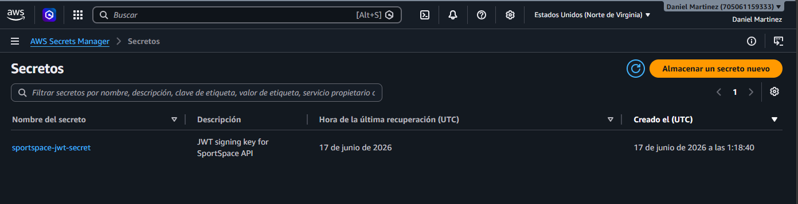

### Deliverable C — OIDC CI Authentication

**Secrets removed from GitHub:**
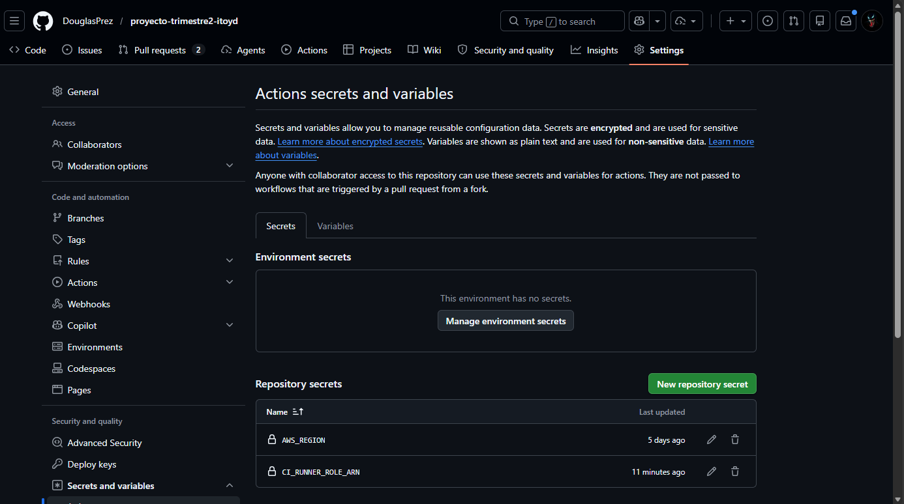

**OIDC auth log in workflow run:**
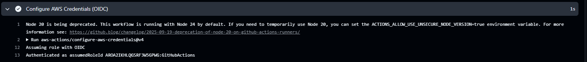

### Deliverable D — TLS Termination

**curl HTTPS verification:**
```
infra/evidence/tls-curl.txt
```

### Deliverable E — Observability Module

**terraform output:**
```
infra/evidence/observability-outputs.txt
```

**CloudWatch Dashboard:**
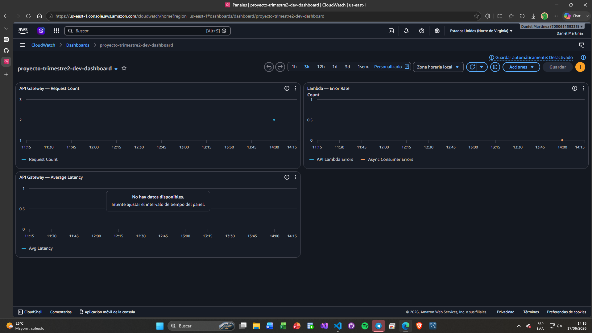

**Cost Budget:**
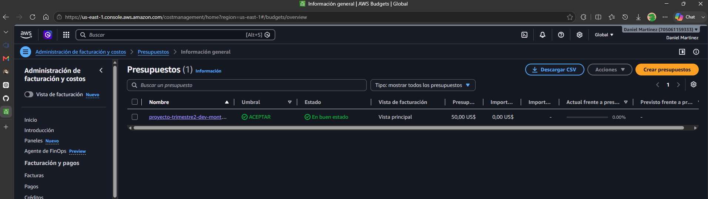

### Deliverable F — One-Click Deployment Proof

**Clean-state pipeline run (all jobs green):**
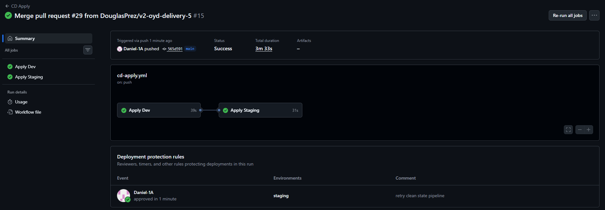

**terraform output after successful apply:**
```
infra/evidence/terraform-output-full.txt
```

**Idempotency check (exit code 0):**
```
infra/evidence/idempotent-plan.txt
```

### Deliverable I — IaC Coverage Proof

**Component-to-IaC mapping:** `infra/docs/iac-coverage.md`

**terraform state list:**
```
infra/evidence/state-list.txt
```

**Deployed components in AWS console:**
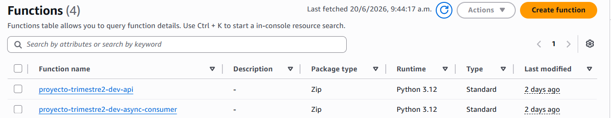

---

## Evidence — Delivery 4

### Deliverable A — Async Messaging Module

**terraform output**
```
queue_url  = "https://sqs.us-east-1.amazonaws.com/705061159333/proyecto-trimestre2-dev-reservations..."
queue_arn  = "arn:aws:sqs:us-east-1:705061159333:proyecto-trimestre2-dev-reservations..."
dlq_url    = "https://sqs.us-east-1.amazonaws.com/705061159333/proyecto-trimestre2-dev-reservations-dlq..."
dlq_arn    = "arn:aws:sqs:us-east-1:705061159333:proyecto-trimestre2-dev-reservations-dlq..."
```
Full output: [async-foundation.txt](evidence/async-foundation.txt)

### Deliverable B — Event-Driven Compute

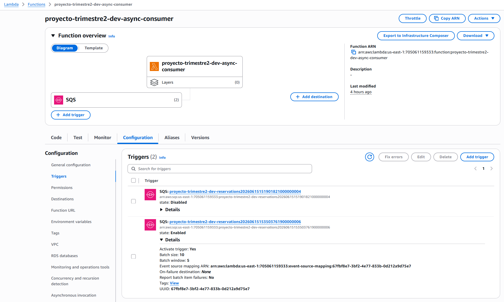

**Plan excerpt:** [event-source-plan.txt](evidence/event-source-plan.txt)

### Deliverable C — Scheduled Jobs

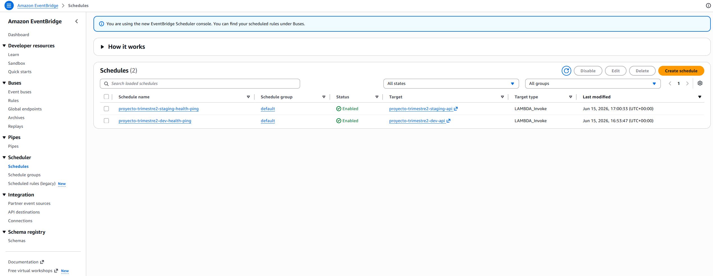

**Plan excerpt:** [scheduler-plan.txt](evidence/scheduler-plan.txt)

### Deliverable D — Full CD Pipeline

| # | Evidence | Screenshot |
|---|---|---|
| 1 | GitHub Environments | 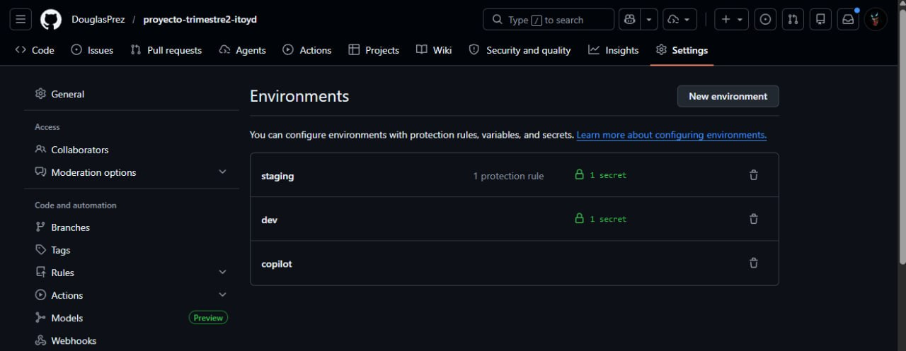 |
| 2 | CI Apply Dev | 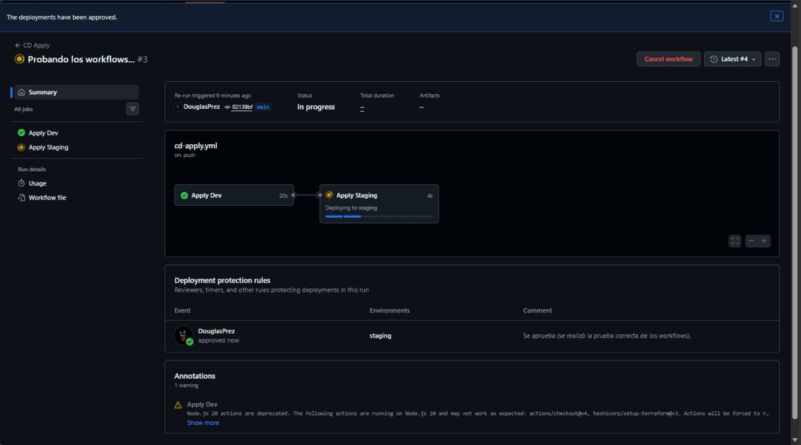 |
| 3 | CI Apply Staging | 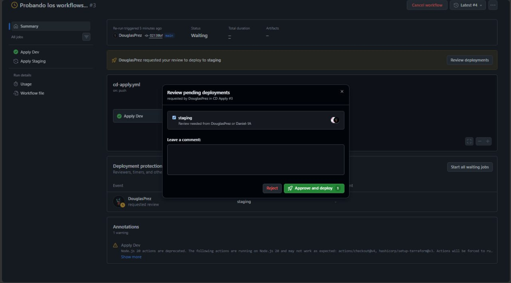 |
| 4 | Ruleset Config | 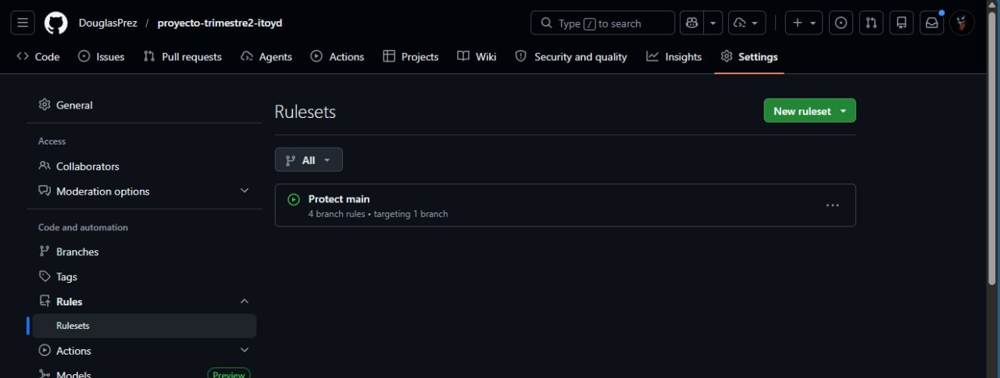 |
| 5 | CI Destroy | 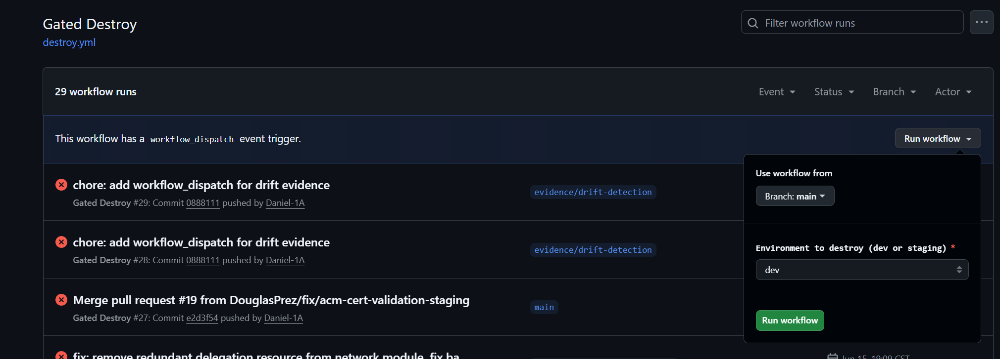 |
| 6 | CI Drift | 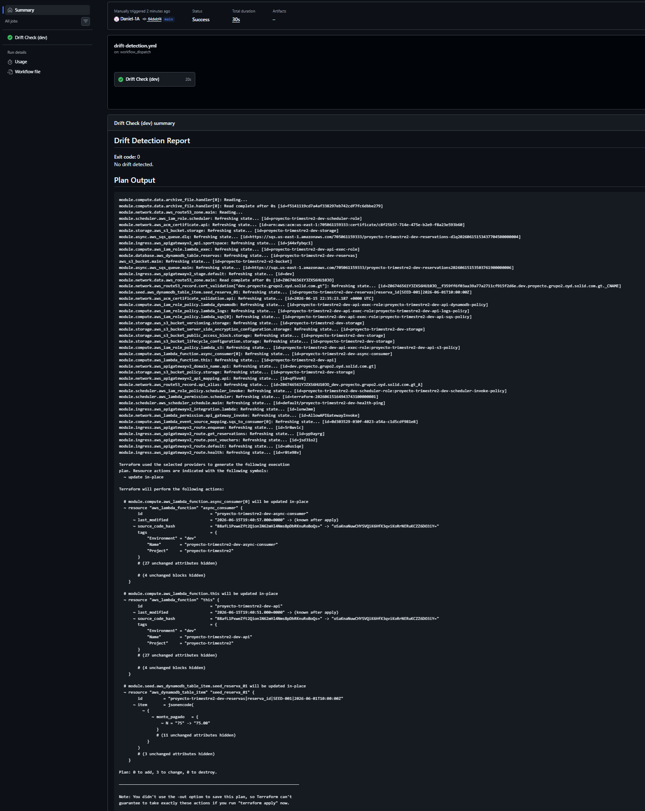 |
| 7 | PR Blocked | 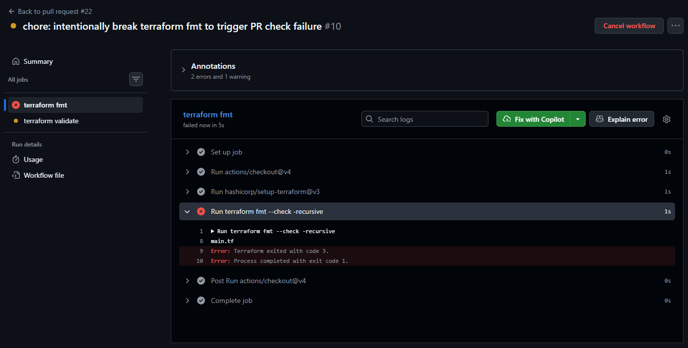 |

### Deliverable E — End-to-End Async Proof

```
POST /reservations/enqueue → 202 {"message_id": "13405097-9b25-4044-a253-0d2bd6d6d71e", ...}
```
Full output: [async-enqueue.txt](evidence/async-enqueue.txt)

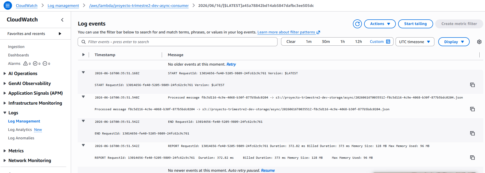
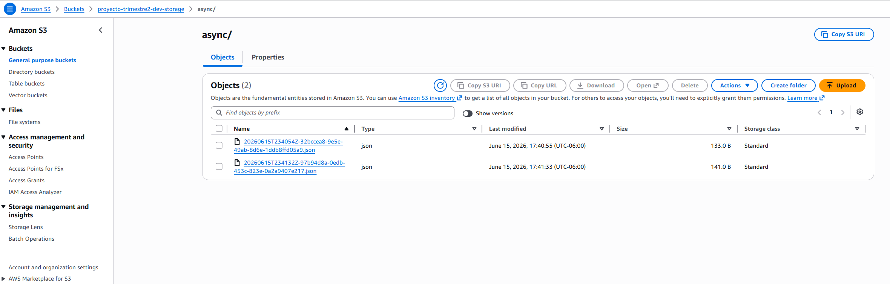
