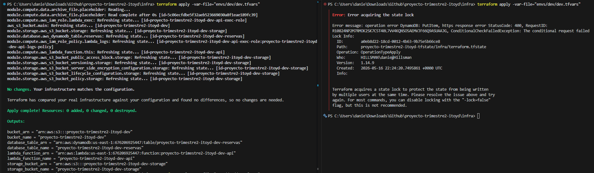

# Infraestructura con Terraform — proyecto-trimestre2-itoyd

Esta configuración de Terraform forma parte del Delivery 1 y tiene como objetivo establecer una infraestructura mínima funcional y un pipeline de integración continua (CI) para despliegues en AWS.

Este directorio contiene la configuración de Terraform que aprovisiona infraestructura en AWS para el proyecto.

---

## Estructura del Proyecto

```
infra/
├── provider.tf          # Proveedor AWS y restricciones de versión de Terraform
├── variables.tf         # Declaración de variables de entrada
├── main.tf              # Definición de recursos
├── outputs.tf           # Valores de salida
├── envs/
│   ├── dev/
│   │   └── dev.tfvars  # Valores de variables para el entorno de desarrollo
│   └── prod/           # Valores de variables para producción (pendiente)
├── modules/             # Módulos reutilizables (pendiente)
└── docs/
    └── delivery-1-summary.md
```

---

## Prerrequisitos

| Herramienta | Versión mínima |
| ----------- | -------------- |
| Terraform   | 1.8            |
| AWS CLI     | 2.x (opcional) |

---

## Configuración de Credenciales AWS

Terraform utiliza las siguientes variables de entorno para autenticarse — **nunca se deben hardcodear en el código**:

```bash
export AWS_ACCESS_KEY_ID="TU_ACCESS_KEY"
export AWS_SECRET_ACCESS_KEY="TU_SECRET_KEY"
export AWS_REGION="TU_REGION"
```

También puedes usar un perfil configurado en AWS CLI:

```bash
export AWS_PROFILE=mi-perfil
```

---

## Inicializar Terraform

Ejecuta el siguiente comando desde el directorio `infra/`:

```bash
cd infra
terraform init
```

Este comando descarga los proveedores necesarios.

Para desarrollo local sin backend remoto:

```bash
terraform init -backend=false
```

---

## Plan

Previsualiza los cambios que Terraform realizará en el entorno de desarrollo:

```bash
terraform plan -var-file="envs/dev/dev.tfvars"
```

Este comando utiliza la configuración del entorno de desarrollo definida en `envs/dev/dev.tfvars`.

---

## Apply

Aplica los cambios para crear o actualizar recursos reales en AWS:

```bash
terraform apply -var-file="envs/dev/dev.tfvars"
```

```bash
terraform apply -var-file="envs/dev/dev.tfvars" -auto-approve
```

> Nota: Este comando crea recursos reales en AWS que pueden generar costos dependiendo del uso.

---

## Destroy

Elimina todos los recursos gestionados por esta configuración:

```bash
terraform destroy -var-file="envs/dev/dev.tfvars"
```

---

## Pipeline de Integración Continua (CI)

Se ha configurado un pipeline en GitHub Actions ubicado en:

```
.github/workflows/terraform-ci.yml
```

Este pipeline se ejecuta automáticamente en cada Pull Request hacia la rama `main` y realiza las siguientes validaciones:

1. **Formato** — `terraform fmt --check -recursive`
2. **Inicialización** — `terraform init -backend=false`
3. **Validación** — `terraform validate`
4. **Plan** — `terraform plan -var-file="envs/dev/dev.tfvars"`

Además, el pipeline publica automáticamente el resultado del `terraform plan` como comentario en el Pull Request.

El pipeline utiliza los siguientes secretos configurados en GitHub:

* `AWS_ACCESS_KEY_ID`
* `AWS_SECRET_ACCESS_KEY`
* `AWS_REGION`

Esto garantiza una autenticación segura sin exponer credenciales en el repositorio.

---

## Evidence

### Compute — Lambda desplegada

```json
{
    "FunctionArn": "arn:aws:lambda:us-east-1:676206925447:function:proyecto-trimestre2-itoyd-dev-api",
    "State": "Active"
}
```

### Storage — S3 bucket desplegado

```
=== Versioning ===
{                                                                                                                                                                                                                                                              
    "Status": "Enabled"
}

=== Encryption ===
{                                                                                                                                                                                                                                                              
    "ServerSideEncryptionConfiguration": {
        "Rules": [
            {
                "ApplyServerSideEncryptionByDefault": {
                    "SSEAlgorithm": "AES256"
                },
                "BucketKeyEnabled": false
            }
        ]
    }
}
```

### Database — DynamoDB tabla desplegada

```json
{
    "TableName": "proyecto-trimestre2-itoyd-dev-reservas",
    "TableStatus": "ACTIVE",
    "BillingMode": "PAY_PER_REQUEST",
    "SSE": "ENABLED"
}
```

### Remote State — Lock contention demostrado



---

## Evidence — Delivery 3

### Deliverable A — Edge & DNS (serverless-only)

**DNS Resolution** — Ver `infra/evidence/edge-dns.txt`

**terraform output**
```
api_custom_endpoint         = "https://grupo2.oyd.solid.com.gt"
api_gateway_endpoint        = "https://dpx91ti4dc.execute-api.us-east-1.amazonaws.com/dev"
hosted_zone_id              = "Z0165481J6MHDXNP4MB4"
hosted_zone_name_servers    = ["ns-1154.awsdns-16.org", "ns-1941.awsdns-50.co.uk",
                               "ns-222.awsdns-27.com", "ns-610.awsdns-12.net"]
```

### Deliverable B — Network Security (least-privilege invoker IAM)

**Lambda Permission Policy** — Ver `infra/evidence/invoker-iam-policy.txt`
```json
{
    "Sid": "AllowAPIGatewayInvoke",
    "Effect": "Allow",
    "Principal": {"Service": "apigateway.amazonaws.com"},
    "Action": "lambda:InvokeFunction",
    "Resource": "arn:aws:lambda:us-east-1:705061159333:function:proyecto-trimestre2-dev-api",
    "Condition": {
        "ArnLike": {
            "AWS:SourceArn": "arn:aws:execute-api:us-east-1:705061159333:dpx91ti4dc/*/*"
        }
    }
}
```

### Deliverable C — Public Ingress Layer

**API Gateway health check** — Ver `infra/evidence/ingress-curl.txt`
```
curl -v https://dpx91ti4dc.execute-api.us-east-1.amazonaws.com/dev/
→ 200 OK  {"status": "ok", "service": "sportspace-api"}
```

**Screenshot** — `infra/evidence/ingress-healthy.png` (tomar de consola AWS → API Gateway → Integrations)

### Deliverable D — End-to-End Connectivity Proof

**GET /reservations** — Ver `infra/evidence/e2e-get.txt`
```
curl -v https://dpx91ti4dc.execute-api.us-east-1.amazonaws.com/dev/reservations
→ 200 OK  {"reservations": [{"reserva_id": "SEED-001", ...}], "count": 1}
```

**POST /vouchers** — Ver `infra/evidence/e2e-post.txt`
```
curl -v -X POST -d '{"test":"delivery3-e2e"}' https://dpx91ti4dc.../dev/vouchers
→ 201 Created  {"object_key": "vouchers/20260604T013310Z.json", "bucket": "proyecto-trimestre2-dev-storage"}
```

**Screenshot S3** — `infra/evidence/e2e-storage.png` (tomar de consola AWS → S3 → proyecto-trimestre2-dev-storage → vouchers/)

### Deliverable E — CI Pipeline Integration

**GitHub Actions plan** — `infra/evidence/ci-plan.png` (tomar screenshot del workflow run)

---

## Evidence — Delivery 4

### Deliverable A — Async Messaging Module

**terraform output** — `infra/evidence/async-foundation.txt`
```
terraform output
```

### Deliverable B — Event-Driven Compute

**terraform plan excerpt** — `infra/evidence/event-source-plan.txt`

**Console screenshot (trigger)** — `infra/evidence/event-source.png`

### Deliverable C — Scheduled Jobs

**Console screenshot** — `infra/evidence/scheduler.png`

**terraform plan excerpt** — `infra/evidence/scheduler-plan.txt`

### Deliverable D — Full CD Pipeline

**PR plan comment** — Link al PR donde el plan se ejecutó y comentó

**Screenshots:**

| # | File | Description |
|---|---|---|
| 1 | `infra/evidence/github-environments.png` | Settings → Environments: dev + staging con protection rules |
| 2 | `infra/evidence/ci-apply-dev.png` | Apply a dev automático después del merge |
| 3 | `infra/evidence/ci-apply-staging.png` | Apply a staging con approval gate y reviewer |
| 4 | `infra/evidence/ci-destroy.png` | Gated destroy workflow_dispatch |
| 5 | `infra/evidence/ci-drift.png` | Drift detection schedule run con plan output |
| 6 | `infra/evidence/ruleset-config.png` | Ruleset Active en main con status checks |
| 7 | `infra/evidence/ruleset-blocked-merge.png` | PR bloqueado por check failing |

### Deliverable E — End-to-End Async Proof

**Curl POST output** — `infra/evidence/async-enqueue.txt`
```
curl -v -X POST -H "Content-Type: application/json" \
  -d '{"key": "value"}' \
  https://grupo2.oyd.solid.com.gt/reservations/enqueue
→ HTTP 202 {"message_id": "..."}
```

**Consumer invocation log** — `infra/evidence/async-consumer.png` (CloudWatch Logs)

**New object in S3** — `infra/evidence/async-object.png` (consola S3 → bucket → async/)